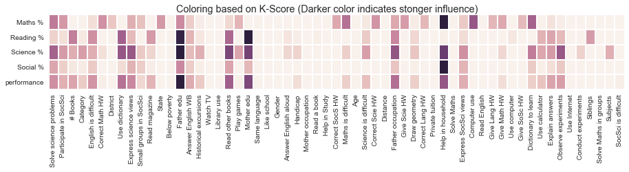
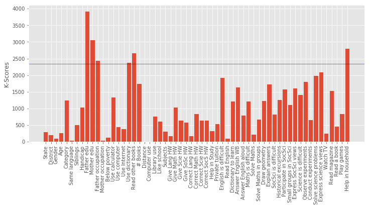
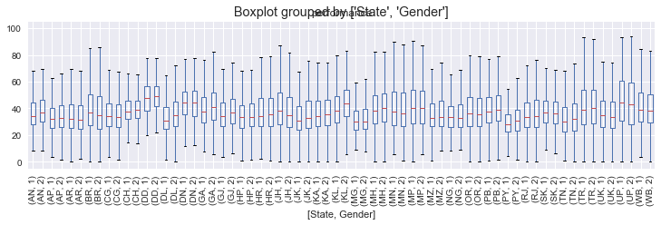
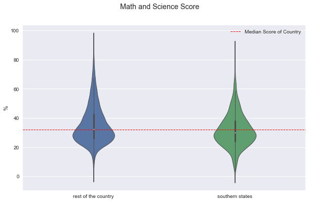
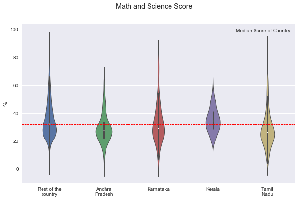

## Questions

1. What influences students performance the most?
2. How do boys and girls perform across states?
3. Do students from South Indian states really excel at Math and Science?

## Importing Dataset


```python
# loading dataset
import pandas as pd
import numpy as np
import matplotlib.pyplot as plt
%matplotlib inline
plt.style.use('ggplot')

marks = pd.read_csv('gramener-usecase-nas/nas-pupil-marks.csv')
labels = pd.read_csv('gramener-usecase-nas/nas-labels.csv')
```


```python
# The shape of data
marks.shape
```

    (185348, 64)


```python
# Splitting the columns into independent categories and performance
category = ['State', 'District', 'Gender', 'Age', 'Category',
       'Same language', 'Siblings', 'Handicap', 'Father edu', 'Mother edu',
       'Father occupation', 'Mother occupation', 'Below poverty',
       'Use calculator', 'Use computer', 'Use Internet', 'Use dictionary',
       'Read other books', '# Books', 'Distance', 'Computer use',
       'Library use', 'Like school', 'Subjects', 'Give Lang HW',
       'Give Math HW', 'Give Scie HW', 'Give SoSc HW', 'Correct Lang HW',
       'Correct Math HW', 'Correct Scie HW', 'Correct SocS HW',
       'Help in Study', 'Private tuition', 'English is difficult',
       'Read English', 'Dictionary to learn', 'Answer English WB',
       'Answer English aloud', 'Maths is difficult', 'Solve Maths',
       'Solve Maths in groups', 'Draw geometry', 'Explain answers',
       'SocSci is difficult', 'Historical excursions', 'Participate in SocSci',
       'Small groups in SocSci', 'Express SocSci views',
       'Science is difficult', 'Observe experiments', 'Conduct experiments',
       'Solve science problems', 'Express science views', 'Watch TV',
       'Read magazine', 'Read a book', 'Play games', 'Help in household']
performance = ['Maths %', 'Reading %', 'Science %', 'Social %']

```

## Answers

### What influences students performance the most?



We defined a performance metric as 'performance' = average of ('Maths %', 'Reading %', 'Science %', 'Social %'). A feature selection is performed based on `SelectKBest` to evaluvate the relative importance in predicting performance. The top features were found for each subject as well as for average of all.

|Parameter|Best Feature |
| --- |:--- |
|Overall Performance|'Father edu'|
|Maths|'Help in household'|
|Reading|'Mother edu'|
|Science|'Father edu'|
|Social|'Help in household'|

This concludeds that the education of parents were the most decisive predictor in deciding a student's  performance. Among top features, 'Father edu' has distinctly higher scores for performance, almost **33%** higher than the second feature indicating a very high relevance.


```python
# adding performance column as the average of all scores
# np.nanmean is used across the horizontal axis to avoid "NaN" values to calculate mean.
marks["performance"]=marks[performance].apply(np.nanmean, axis=1)
marks["performance"].describe()
```


    count    180774.000000
    mean         38.095342
    std          14.949624
    min           0.000000
    25%          27.035000
    50%          35.640000
    75%          47.320000
    max         100.000000
    Name: performance, dtype: float64


#### Functions defined to choose important features

```python
def clean_data(marks, y_col_name="performance"):
    # Creating traning set X and target y
    from sklearn.preprocessing import LabelEncoder

    # Remove all rows with performance is undefined i.e. "NaN" 
    marks_nona = marks.dropna(subset=[y_col_name])

    # Cloning marks to make a training set X
    X = marks_nona[category].copy(deep=True)

    # string encoded columns are converted to np array to create training set x
    encoded_columns = ["State","Use computer", "Subjects"]
    le_state = LabelEncoder()
    le_subject = LabelEncoder()
    le_use_comp = LabelEncoder()
    X["State"] = le_state.fit_transform(X["State"])
    X["Subjects"] = le_subject.fit_transform(X["Subjects"])
    X["Use computer"] = le_use_comp.fit_transform(X["Use computer"].fillna(value="0"))

    print("Shape of X\t:",X.shape)

    # target variable y 
    y = marks_nona[y_col_name]
    print ("Shape of y\t:",y.shape)
    return X, y
```


```python
def best_features(X,y):
    # Pipeline is defined for feature selection
    from sklearn.feature_selection import SelectKBest,f_regression,mutual_info_regression
    from sklearn.pipeline import Pipeline
    from sklearn.preprocessing import StandardScaler

    pipe = Pipeline(steps = [('scaler', StandardScaler()),\
                                ('selK', SelectKBest(k="all",score_func=f_regression))])
    pipe.fit(X.astype(float).values,y.astype(float).values)

    # score of top 10 features is sorted in descending order
    k_scores = pipe.named_steps["selK"].scores_
#     k_scores = k_scores/sum(k_scores)
    scores_tuple = zip(X.columns,k_scores)
    sorted_scores = sorted(scores_tuple,key=lambda score:score[1], reverse=True)
    print ("Best 5 Features:\n",sorted_scores[:5])
    
    # Plotting the best features
    fig=plt.figure(figsize=(12,5))
    plt.bar(np.arange(len(k_scores)),k_scores,label = X.columns)
    plt.axhline(y=max(k_scores)*0.6,color='b',linewidth=.5)
    plt.xticks(np.arange(len(k_scores)),X.columns,rotation="vertical")
    plt.ylabel("K-Scores")
    plt.show()
    
    return sorted_scores

def tuple_to_dict(scores_tuple):
    """
    converts an array of tuple (key,value) to a dictionary {key:value}
    """
    i = 0;
    my_dict = {}
    while i<len(scores_tuple):
        key, value = scores_tuple[i]
        my_dict.update({key : value})
        i = i+1
    return my_dict
    
```


```python
target = ["performance","Maths %","Reading %","Science %","Social %"]
final_stat = {}

for t in target:
    print("======\tTarget Variable\t:",t,"======")
    X, y = clean_data(marks,y_col_name=t)
    sorted_scores = best_features(X,y)
    final_stat.update({t : tuple_to_dict(sorted_scores)})
    best_f = sorted_scores[0][0]
    
    # plotting
    marks.boxplot(column=t, by=best_f,figsize=(8,5))
    plt.title(t)
    plt.tight_layout()
    plt.suptitle("")
    print (labels[labels["Column"]==best_f])
    plt.show()
```

    ======	Target Variable	: performance ======
    Shape of X	: (180774, 59)
    Shape of y	: (180774,)
    Best 5 Features:
     [('Father edu', 3906.8744966773766), ('Mother edu', 3052.1893687615902), ('Help in household', 2793.8799410412198), ('Read other books', 2661.1779134014673), ('Father occupation', 2428.0365114374408)]





            Column                    Name Level          Rename
    24  Father edu        Degree and above     5  Degree & above
    25  Father edu              Illiterate     1      Illiterate
    26  Father edu          Not applicable     0  Not applicable
    27  Father edu           Primary level     2         Primary
    28  Father edu         Secondary level     3       Secondary
    29  Father edu  Senior secondary level     4    Sr secondary


    ======	Target Variable	: Maths % ======
    Shape of X	: (92681, 59)
    Shape of y	: (92681,)
    Best 5 Features:
     [('Help in household', 914.12688336032204), ('Computer use', 651.62580084653632), ('Dictionary to learn', 610.29101679041355), ('Maths is difficult', 556.06941787824678), ('Solve science problems', 526.11708504368846)]


                    Column          Name Level        Rename
    204  Help in household     Every day     4     Every day
    205  Help in household         Never     1         Never
    206  Help in household  Once a month     2  Once a month
    207  Help in household   Once a week     3   Once a week


    ======	Target Variable	: Reading % ======
    Shape of X	: (93271, 59)
    Shape of y	: (93271,)
    Best 5 Features:
     [('Mother edu', 3424.4980512295078), ('Father edu', 3329.8749927211034), ('Use dictionary', 2309.8832945874847), ('Read other books', 2200.3369324634891), ('# Books', 1922.4965853283888)]


            Column                    Name Level          Rename
    30  Mother edu        Degree and above     5  Degree & above
    31  Mother edu              Illiterate     1      Illiterate
    32  Mother edu          Not applicable     0  Not applicable
    33  Mother edu           Primary level     2         Primary
    34  Mother edu         Secondary level     3       Secondary
    35  Mother edu  Senior secondary level     4    Sr secondary


    ======	Target Variable	: Science % ======
    Shape of X	: (90992, 59)
    Shape of y	: (90992,)
    Best 5 Features:
     [('Father edu', 1227.5175152615805), ('Help in household', 1024.425737832905), ('Mother edu', 985.68094452340586), ('Read other books', 960.69082698717637), ('Father occupation', 887.2845094505285)]


            Column                    Name Level          Rename
    24  Father edu        Degree and above     5  Degree & above
    25  Father edu              Illiterate     1      Illiterate
    26  Father edu          Not applicable     0  Not applicable
    27  Father edu           Primary level     2         Primary
    28  Father edu         Secondary level     3       Secondary
    29  Father edu  Senior secondary level     4    Sr secondary


    ======	Target Variable	: Social % ======
    Shape of X	: (89571, 59)
    Shape of y	: (89571,)
    Best 5 Features:
     [('Help in household', 1953.6981406711302), ('Father edu', 1042.1749875474054), ('Read other books', 862.49475538243018), ('Solve science problems', 843.71858538199774), ('Express science views', 771.77171134892569)]


                    Column          Name Level        Rename
    204  Help in household     Every day     4     Every day
    205  Help in household         Never     1         Never
    206  Help in household  Once a month     2  Once a month
    207  Help in household   Once a week     3   Once a week


```python
# K-scores are normalized by maximum score (along each row) to show the strongest predictor for each row
import seaborn as sns
s = pd.DataFrame.from_dict(final_stat, orient='index')
final = s.divide(s.max(axis=1),axis = 0)

# plotting heat map 
plt.figure(figsize=(15,2))
f = sns.heatmap(final, linewidths = 1,square= False, cbar= False, vmin=0.2)
plt.suptitle("Coloring based on K-Score (Darker color indicates stonger influence)")
plt.show()
```


### How do boys and girls perform across states?


Across various states Girls tend to have a higher median performance than boys.

Some of the states with notable exception to this rule is Jharkand (JH) and Bihar (BH). Since these state have high gender inequality, this trend could be due to lack of access to education to girls. To confirm, it has to be crosschecked with percentage of girls with access to education.


```python
# Eliminating Gender not equal to 1 or 2
marks_gender = marks.dropna(subset=["performance"])
marks_gender =marks_gender[marks_gender["Gender"]!=0]
marks_gender.boxplot(column="performance", by=["State","Gender"], figsize=(12, 3))
plt.xticks(rotation="vertical")
plt.show()
```





```python
# Gender: boy =1, girl =2

gender_performance = marks_gender.groupby(["State","Gender"]).median()["performance"]

perf_lst = []
for l in gender_performance.index:
    perf_dict = {
        "State" : l[0],
        "Gender" : l[1],
        "performance" : gender_performance[l]    
    }
    perf_lst.append(perf_dict)
```


```python
G_perfomance = pd.DataFrame(perf_lst)
G_perfomance = G_perfomance.pivot(index='State', columns='Gender', values='performance')
G_perfomance.columns = ["Boy","Girl"]
G_perfomance["diff"]=G_perfomance["Boy"]-G_perfomance["Girl"]
G_perfomance["Boys_better"]=(G_perfomance["Boy"]-G_perfomance["Girl"])>0
```


```python
import matplotlib.colors as colors
from matplotlib.cm import bwr as cmap
import matplotlib.patches as mpatches

plt.figure(figsize=(12,5))

# setting colors. Maps the max and min values in "diff" to a color map bwr
c_normal = colors.PowerNorm(1,vmin=min(G_perfomance["diff"]), vmax=max(G_perfomance["diff"]))
_COLORS = cmap(c_normal(G_perfomance["diff"]))

plt.bar(np.arange(len(G_perfomance["diff"])), 
        height = G_perfomance["diff"], width = 0.75, align = "center", color=_COLORS)
plt.xticks(np.arange(len(G_perfomance.index)),list(G_perfomance.index))
plt.axhline(0, color='k', linewidth = 0.5)
plt.xlabel("State")
plt.ylabel("Median Performance Difference\n(Boys - Girls)")

# creating legend patches
red_patch = mpatches.Patch(color='red', label='Boys Perform Better')
blue_patch = mpatches.Patch(color='blue', label='Girls Perform Better')
plt.legend(handles=[red_patch, blue_patch], loc=4)

plt.show()
```


### Do students from South Indian states really excel at Math and Science?

In order to do the analysis, Here we considered southern states as : "Andhra Pradesh", "Kerala", "Karnataka" and "Tamil Nadu". Meanwhile other states are referred to "the rest of the country". The performance score for 'Science and Math' is defined as the mean value of both 'Science' and 'Math'. 



We found that central tendendencies of `Southern States` to be slight lower than the rest of the country. But it should be noted that the number of samples in the `Southern States` is far less. Also, it should be understood that the enrollment rate of southern states is usually higher than rest of country which could be driving down the median values.



To identify if all southern states follow this pattern, we split the data into corresponding southern states. We found that "Kerala" as a notable exception to the trend of southern states. "Kerala" tends to have higher median score than other southern states, rest of the country and the overall median of country. Another exception is the distribution of marks from "Tamil Nadu" with longer tails. "Tamil Nadu" followed the trend of the rest of the country with longer tails at highest end but has lower median score than all others.


```python
marks['math_sci'] = marks[['Maths %','Science %']].apply(np.nanmean,axis=1)
```

    /Users/Bibin/anaconda/lib/python3.5/site-packages/pandas/core/frame.py:4416: RuntimeWarning: Mean of empty slice
      labels=labels)


```python
# Defining a dataframe "south" with columns = [state,math_science]. 
south = marks[['State','Maths %','Science %','math_sci']].dropna(subset=['Maths %','Science %'])
print (south.isnull().sum())
print(south.columns)
```

    State        0
    Maths %      0
    Science %    0
    math_sci     0
    dtype: int64
    Index(['State', 'Maths %', 'Science %', 'math_sci'], dtype='object')


```python
# separating southern states from rest of the country
STATES = list(south["State"].unique())
SOUTH_STATES = ["KL", "AP","TN","KA"]
REST = [S for S in STATES if S not in SOUTH_STATES]
south["is_south"] = south["State"].isin(SOUTH_STATES)

# function to add a new column "south_vs_rest"
def add_col_south_vs_rest(south,SOUTH_STATES):
    """
    Returns a new lst with south["state"] as 
    the value if the state is in SOUTH_STATES, 
    else with the value "Rest"
    """
    lst = []
    for index in range(south.shape[0]):
        state = south.iloc[index]["State"]
        if state in SOUTH_STATES:
            lst.append(state)
        else:
            lst.append("Rest")
    return lst
south["south_vs_rest"] = add_col_south_vs_rest(south,SOUTH_STATES)
```


```python
print (south.describe())
south.groupby(by = "is_south").describe()
```

                Maths %     Science %      math_sci
    count  17895.000000  17895.000000  17895.000000
    mean      32.529734     37.661108     35.095421
    std       15.194263     14.944558     13.059281
    min        0.000000      0.000000      0.000000
    25%       22.030000     27.270000     25.925000
    50%       28.810000     34.550000     32.145000
    75%       38.980000     46.430000     41.877500
    max       98.310000     94.640000     94.675000


```python
for factor in ["math_sci","Maths %","Science %"]:
    fig = south.boxplot(column = factor, by ="is_south")
    plt.axhline(south[factor].median(), color='k', linewidth = 0.5, linestyle ="--",\
                label="Median Score of Country")
    plt.ylabel(" %")
    fig.set_xticklabels(["rest of the country","southern states"])
    plt.suptitle("")
    plt.xlabel("")
    plt.legend()
    plt.show()
```


```python
plt.figure(1)
sns.countplot(x="is_south", data=south)
plt.figure(2)
sns.countplot(x="south_vs_rest", data=south)
plt.show()
```


```python
# sns.stripplot(x="is_south", y="math_sci",data=south, jitter=True, alpha=0.2)
plt.figure(figsize = (10,6))
f = sns.violinplot(x="is_south", y="math_sci",data=south, fliersize=0, width = .3, notch =True, linewidth =1)
plt.axhline(south["math_sci"].median(), color='r', linewidth = 1, linestyle ="--",\
                label="Median Score of Country")
f.set_xticklabels(["rest of the country","southern states"])
plt.suptitle("Math and Science Score")
plt.xlabel("")
plt.ylabel("%")
plt.legend()
plt.show()
```


```python
# spltting each southern state to compare with the rest of the country
for factor in ["math_sci","Maths %","Science %"]:
    fig = south.boxplot(column = factor, by ="south_vs_rest")
    plt.axhline(south[factor].median(), color='k', linewidth = 0.5, linestyle ="--",\
                label="Median Score of Country")
    plt.ylabel(" %")
    plt.suptitle("")
    plt.xlabel("")
    plt.legend()
    plt.show()
```


```python
# Math and science score for each of the southern state
plt.figure(figsize = (10,6))

f = sns.violinplot(x="south_vs_rest", y="math_sci",data=south,\
                   fliersize=0, width = .3, notch =True, linewidth =1,\
                  order=["Rest","AP","KA","KL","TN"])
plt.axhline(south["math_sci"].median(), color='r', linewidth = 1, linestyle ="--",\
                label="Median Score of Country")
f.set_xticklabels(["Rest of the\ncountry","Andhra\nPradesh","Karnataka","Kerala", "Tamil\nNadu"])
plt.suptitle("Math and Science Score")
plt.xlabel("")
plt.ylabel("%")
plt.legend()
# plt.twinx()
# sns.countplot(x="south_vs_rest", data=south, width = 0.2)
plt.show()
```


