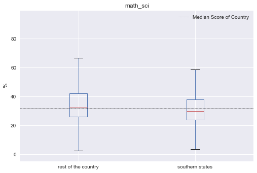

* auto-gen TOC:
{:toc}

## Questions

1. What influences students performance the most?
2. How do boys and girls perform across states?
3. Do students from South Indian states really excel at Math and Science?

[here](another.md)

## Data Exploration


```python
# loading dataset
import pandas as pd
import numpy as np
import matplotlib.pyplot as plt
%matplotlib inline

marks = pd.read_csv('gramener-usecase-nas/nas-pupil-marks.csv')
labels = pd.read_csv('gramener-usecase-nas/nas-labels.csv')
```


```python
marks.head(3)
```


<div>
<style>
    .dataframe thead tr:only-child th {
        text-align: right;
    }

    .dataframe thead th {
        text-align: left;
    }

    .dataframe tbody tr th {
        vertical-align: top;
    }
</style>
<table border="1" class="dataframe">
  <thead>
    <tr style="text-align: right;">
      <th></th>
      <th>STUID</th>
      <th>State</th>
      <th>District</th>
      <th>Gender</th>
      <th>Age</th>
      <th>Category</th>
      <th>Same language</th>
      <th>Siblings</th>
      <th>Handicap</th>
      <th>Father edu</th>
      <th>...</th>
      <th>Express science views</th>
      <th>Watch TV</th>
      <th>Read magazine</th>
      <th>Read a book</th>
      <th>Play games</th>
      <th>Help in household</th>
      <th>Maths %</th>
      <th>Reading %</th>
      <th>Science %</th>
      <th>Social %</th>
    </tr>
  </thead>
  <tbody>
    <tr>
      <th>0</th>
      <td>11011001001</td>
      <td>AP</td>
      <td>1</td>
      <td>1</td>
      <td>3</td>
      <td>3</td>
      <td>1</td>
      <td>5</td>
      <td>2</td>
      <td>1</td>
      <td>...</td>
      <td>3</td>
      <td>3</td>
      <td>4</td>
      <td>3</td>
      <td>4</td>
      <td>4</td>
      <td>20.37</td>
      <td>NaN</td>
      <td>27.78</td>
      <td>NaN</td>
    </tr>
    <tr>
      <th>1</th>
      <td>11011001002</td>
      <td>AP</td>
      <td>1</td>
      <td>2</td>
      <td>3</td>
      <td>4</td>
      <td>2</td>
      <td>5</td>
      <td>2</td>
      <td>2</td>
      <td>...</td>
      <td>3</td>
      <td>4</td>
      <td>4</td>
      <td>3</td>
      <td>4</td>
      <td>4</td>
      <td>12.96</td>
      <td>NaN</td>
      <td>38.18</td>
      <td>NaN</td>
    </tr>
    <tr>
      <th>2</th>
      <td>11011001003</td>
      <td>AP</td>
      <td>1</td>
      <td>2</td>
      <td>3</td>
      <td>4</td>
      <td>2</td>
      <td>5</td>
      <td>2</td>
      <td>1</td>
      <td>...</td>
      <td>3</td>
      <td>4</td>
      <td>3</td>
      <td>3</td>
      <td>4</td>
      <td>4</td>
      <td>27.78</td>
      <td>70.0</td>
      <td>NaN</td>
      <td>NaN</td>
    </tr>
  </tbody>
</table>
<p>3 rows × 64 columns</p>
</div>


```python
# Column names of dataset
marks.columns
```


    Index(['STUID', 'State', 'District', 'Gender', 'Age', 'Category',
           'Same language', 'Siblings', 'Handicap', 'Father edu', 'Mother edu',
           'Father occupation', 'Mother occupation', 'Below poverty',
           'Use calculator', 'Use computer', 'Use Internet', 'Use dictionary',
           'Read other books', '# Books', 'Distance', 'Computer use',
           'Library use', 'Like school', 'Subjects', 'Give Lang HW',
           'Give Math HW', 'Give Scie HW', 'Give SoSc HW', 'Correct Lang HW',
           'Correct Math HW', 'Correct Scie HW', 'Correct SocS HW',
           'Help in Study', 'Private tuition', 'English is difficult',
           'Read English', 'Dictionary to learn', 'Answer English WB',
           'Answer English aloud', 'Maths is difficult', 'Solve Maths',
           'Solve Maths in groups', 'Draw geometry', 'Explain answers',
           'SocSci is difficult', 'Historical excursions', 'Participate in SocSci',
           'Small groups in SocSci', 'Express SocSci views',
           'Science is difficult', 'Observe experiments', 'Conduct experiments',
           'Solve science problems', 'Express science views', 'Watch TV',
           'Read magazine', 'Read a book', 'Play games', 'Help in household',
           'Maths %', 'Reading %', 'Science %', 'Social %'],
          dtype='object')


```python
# The shape of data
marks.shape
```


    (185348, 64)


```python
# Splitting the columns into independent categories and performance
category = ['State', 'District', 'Gender', 'Age', 'Category',
       'Same language', 'Siblings', 'Handicap', 'Father edu', 'Mother edu',
       'Father occupation', 'Mother occupation', 'Below poverty',
       'Use calculator', 'Use computer', 'Use Internet', 'Use dictionary',
       'Read other books', '# Books', 'Distance', 'Computer use',
       'Library use', 'Like school', 'Subjects', 'Give Lang HW',
       'Give Math HW', 'Give Scie HW', 'Give SoSc HW', 'Correct Lang HW',
       'Correct Math HW', 'Correct Scie HW', 'Correct SocS HW',
       'Help in Study', 'Private tuition', 'English is difficult',
       'Read English', 'Dictionary to learn', 'Answer English WB',
       'Answer English aloud', 'Maths is difficult', 'Solve Maths',
       'Solve Maths in groups', 'Draw geometry', 'Explain answers',
       'SocSci is difficult', 'Historical excursions', 'Participate in SocSci',
       'Small groups in SocSci', 'Express SocSci views',
       'Science is difficult', 'Observe experiments', 'Conduct experiments',
       'Solve science problems', 'Express science views', 'Watch TV',
       'Read magazine', 'Read a book', 'Play games', 'Help in household']
performance = ['Maths %', 'Reading %', 'Science %', 'Social %']

# unique values in each category
for c in category:
    print (c,":",marks[c].unique())
```

    State : ['AP' 'AR' 'BR' 'CG' 'DL' 'GA' 'GJ' 'HR' 'HP' 'JK' 'JH' 'KA' 'KL' 'MP' 'MH'
     'MN' 'MG' 'MZ' 'NG' 'OR' 'PB' 'RJ' 'SK' 'TN' 'TR' 'UP' 'UK' 'WB' 'AN' 'CH'
     'PY' 'DN' 'DD']
    District : [ 1  2  3  4  5  6  7  8  9 10 11 12 13 14 15 16 17 18 19 20 21 22 23 24 25
     26 27 28]
    Gender : [1 2 0]
    Age : [3 2 5 0 4 6 1]
    Category : [3 4 0 1 2]
    Same language : [1 2 0]
    Siblings : [5 4 2 3 1]
    Handicap : [2 0 1]
    Father edu : [1 2 3 0 4 5]
    Mother edu : [1 2 0 3 5 4]
    Father occupation : [3 7 0 5 2 4 1 8 6]
    Mother occupation : [3 5 2 0 1 6 4 7 8]
    Below poverty : [0 1 2]
    Use calculator : [1 2 0]
    Use computer : ['No' nan 'Yes']
    Use Internet : [1 2 0]
    Use dictionary : [2 1 0]
    Read other books : [2 1 0]
    # Books : [2 4 1 0 3]
    Distance : [1 2 3 4 0]
    Computer use : [2 3 1 5 4 0]
    Library use : [2 3 4 0 1 5]
    Like school : [2 1 0]
    Subjects : ['L' 'S' 'O' 'M' '0']
    Give Lang HW : [4 0 1 3 2]
    Give Math HW : [4 3 0 1 2]
    Give Scie HW : [3 4 0 2 1]
    Give SoSc HW : [3 4 0 2 1]
    Correct Lang HW : [4 1 2 3 0]
    Correct Math HW : [4 3 1 2 0]
    Correct Scie HW : [4 2 3 1 0]
    Correct SocS HW : [4 3 2 1 0]
    Help in Study : [2 1 0]
    Private tuition : [1 2 0]
    English is difficult : [3 1 2 0]
    Read English : [3 1 2 0]
    Dictionary to learn : [3 1 2 0]
    Answer English WB : [3 2 1 0]
    Answer English aloud : [2 3 1 0]
    Maths is difficult : [2 1 3 0]
    Solve Maths : [2 3 1 0]
    Solve Maths in groups : [3 2 1 0]
    Draw geometry : [1 3 2 0]
    Explain answers : [3 1 2 0]
    SocSci is difficult : [1 3 2 0]
    Historical excursions : [3 1 2 0]
    Participate in SocSci : [3 1 2 0]
    Small groups in SocSci : [2 3 1 0]
    Express SocSci views : [3 2 1 0]
    Science is difficult : [2 3 1 0]
    Observe experiments : [3 2 1 0]
    Conduct experiments : [3 2 0 1]
    Solve science problems : [3 1 2 0]
    Express science views : [3 1 2 0]
    Watch TV : [3 4 2 1 0]
    Read magazine : [4 3 1 2 0]
    Read a book : [3 2 4 1 0]
    Play games : [4 3 2 1 0]
    Help in household : [4 3 1 2 0]


### What influences students performance the most?

We defined a performance metric as the average of ('Maths %', 'Reading %', 'Science %', 'Social %'). A feature selection is performed based on `SelectKBest` to evaluvate the relative importance in predicting performance. The top 4 features were found to be 

|Rank|Feature |Score|
| --- |:--- |--- |
|1|'Father edu'| 3906.87|
|2|'Mother edu'| 3052.18|
|3|'Help in household'| 2793.88|
|4|'Read other books'| 2661.18|

This concludeds that the education of parents were the most decisive predictor in deciding a student's average performance. Among top features, 'Father edu' has distinctly higher scores, almost **33%** higher than the second top feature indicating a higher relevance.


```python
# adding performance column as the average of all scores
# np.nanmean is used across the horizontal axis to avoid "NaN" values to calculate mean.
marks["performance"]=marks[performance].apply(np.nanmean, axis=1)
marks["performance"].describe()
```

    /Users/Bibin/anaconda/lib/python3.5/site-packages/pandas/core/frame.py:4416: RuntimeWarning: Mean of empty slice
      labels=labels)


    count    180774.000000
    mean         38.095342
    std          14.949624
    min           0.000000
    25%          27.035000
    50%          35.640000
    75%          47.320000
    max         100.000000
    Name: performance, dtype: float64


```python
# no. of null values and corresponding columns
pd.isnull(marks).sum()[pd.isnull(marks).sum()!=0]
```


    Use computer    19162
    Maths %         92667
    Reading %       92077
    Science %       94356
    Social %        95777
    performance      4574
    dtype: int64


```python
# Creating traning set X and target y
from sklearn.preprocessing import LabelEncoder

# Cloning marks to make a training set X
X = marks_nona[category].copy(deep=True)

# string encoded columns are converted to np array to create training set x
encoded_columns = ["State","Use computer", "Subjects"]
le_state = LabelEncoder()
le_subject = LabelEncoder()
le_use_comp = LabelEncoder()
X["State"] = le_state.fit_transform(X["State"])
X["Subjects"] = le_subject.fit_transform(X["Subjects"])
X["Use computer"] = le_use_comp.fit_transform(X["Use computer"].fillna(value="0"))

print("Number of features\t:",X.shape)

# target variable y is defined as performance
y = marks_nona["performance"]
print ("Number of observations\t:",y.shape)
```

    Number of features	: (180774, 59)
    Number of observations	: (180774,)


```python
# Pipeline is defined for feature selection
from sklearn.feature_selection import SelectKBest,f_regression,mutual_info_regression
from sklearn.pipeline import Pipeline
from sklearn.preprocessing import StandardScaler

pipe = Pipeline(steps = [('scaler', StandardScaler()),\
                            ('selK', SelectKBest(k="all",score_func=f_regression))])
pipe.fit(X.astype(float).values,y.astype(float).values)

# score of top 10 features is sorted in descending order
k_scores = pipe.named_steps["selK"].scores_
scores_tuple = zip(X.columns,pipe.named_steps["selK"].scores_)
sorted_scores = sorted(scores_tuple,key=lambda score:score[1], reverse=True)
sorted_scores[:10]
```


    [('Father edu', 3906.8744966773766),
     ('Mother edu', 3052.1893687615902),
     ('Help in household', 2793.8799410412198),
     ('Read other books', 2661.1779134014673),
     ('Father occupation', 2428.0365114374408),
     ('Use dictionary', 2379.4342346431717),
     ('Express science views', 2083.5083359357386),
     ('Solve science problems', 1984.007619045396),
     ('English is difficult', 1912.9856032437244),
     ('Observe experiments', 1800.2645390562559)]


```python
fig=plt.figure(figsize=(15,5))
plt.bar(np.arange(len(k_scores)),k_scores,label = X.columns)
plt.axhline(y=max(k_scores)*0.6,color='r',linewidth=.5)
plt.xticks(np.arange(len(k_scores)),X.columns,rotation="vertical")
plt.ylabel("K-Scores")
plt.show()
```


```python
marks_nona.boxplot(column="performance", by="Father edu")
plt.show()
```


### How do boys and girls perform across states?

Across various states Girls tend to have a higher median performance than boys.

Some of the states with notable exception to this rule is Jharkand (JH) and Bihar (BH). Since these state have high gender inequality, this trend could be due to lack of access to education to girls. To confirm, it has to crosschecked with percentage of girls with access to education.


```python
# Eliminating Gender not equal to 1 or 2
marks_gender = marks_nona[marks_nona["Gender"]!=0]
marks_gender.boxplot(column="performance", by=["State","Gender"], figsize=(12, 3))
plt.xticks(rotation="vertical")
plt.show()
```


```python
# Gender: boy =1, girl =2

gender_performance = marks_gender.groupby(["State","Gender"]).median()["performance"]

perf_lst = []
for l in gender_performance.index:
    perf_dict = {
        "State" : l[0],
        "Gender" : l[1],
        "performance" : gender_performance[l]    
    }
    perf_lst.append(perf_dict) 
```


```python
G_perfomance = pd.DataFrame(perf_lst)
G_perfomance = G_perfomance.pivot(index='State', columns='Gender', values='performance')
G_perfomance.columns = ["Boy","Girl"]
G_perfomance["diff"]=G_perfomance["Boy"]-G_perfomance["Girl"]
G_perfomance["Boys_better"]=(G_perfomance["Boy"]-G_perfomance["Girl"])>0
```


```python
import matplotlib.colors as colors
from matplotlib.cm import bwr as cmap
import matplotlib.patches as mpatches

plt.figure(figsize=(12,5))

# setting colors. Maps the max and min values in "diff" to a color map bwr
c_normal = colors.PowerNorm(1,vmin=min(G_perfomance["diff"]), vmax=max(G_perfomance["diff"]))
_COLORS = cmap(c_normal(G_perfomance["diff"]))

plt.bar(np.arange(len(G_perfomance["diff"])), 
        height = G_perfomance["diff"], width = 0.5, align = "center", color=_COLORS)
plt.xticks(np.arange(len(G_perfomance.index)),list(G_perfomance.index))
plt.axhline(0, color='k', linewidth = 0.3)
plt.ylabel("Median Performance Difference\n(Boys - Girls)")

# creating legend patches
red_patch = mpatches.Patch(color='red', label='Boys Perform Better')
blue_patch = mpatches.Patch(color='blue', label='Girls Perform Better')
plt.legend(handles=[red_patch, blue_patch], loc=4)

plt.show()
```


```python
# Sorted list of States with higher performance for Boys
G_perfomance[G_perfomance["diff"]>0].sort_values("diff", ascending=False)
```


<div>
<style>
    .dataframe thead tr:only-child th {
        text-align: right;
    }

    .dataframe thead th {
        text-align: left;
    }

    .dataframe tbody tr th {
        vertical-align: top;
    }
</style>
<table border="1" class="dataframe">
  <thead>
    <tr style="text-align: right;">
      <th></th>
      <th>Boy</th>
      <th>Girl</th>
      <th>diff</th>
      <th>Boys_better</th>
    </tr>
    <tr>
      <th>State</th>
      <th></th>
      <th></th>
      <th></th>
      <th></th>
    </tr>
  </thead>
  <tbody>
    <tr>
      <th>JH</th>
      <td>38.335000</td>
      <td>35.1925</td>
      <td>3.142500</td>
      <td>True</td>
    </tr>
    <tr>
      <th>BR</th>
      <td>37.000000</td>
      <td>35.0000</td>
      <td>2.000000</td>
      <td>True</td>
    </tr>
    <tr>
      <th>UK</th>
      <td>34.965000</td>
      <td>33.6750</td>
      <td>1.290000</td>
      <td>True</td>
    </tr>
    <tr>
      <th>UP</th>
      <td>44.365000</td>
      <td>43.3350</td>
      <td>1.030000</td>
      <td>True</td>
    </tr>
    <tr>
      <th>WB</th>
      <td>39.165000</td>
      <td>38.3350</td>
      <td>0.830000</td>
      <td>True</td>
    </tr>
    <tr>
      <th>MN</th>
      <td>37.275000</td>
      <td>36.4650</td>
      <td>0.810000</td>
      <td>True</td>
    </tr>
    <tr>
      <th>AR</th>
      <td>32.087500</td>
      <td>31.3350</td>
      <td>0.752500</td>
      <td>True</td>
    </tr>
    <tr>
      <th>SK</th>
      <td>36.777500</td>
      <td>36.0700</td>
      <td>0.707500</td>
      <td>True</td>
    </tr>
    <tr>
      <th>OR</th>
      <td>36.370000</td>
      <td>35.7400</td>
      <td>0.630000</td>
      <td>True</td>
    </tr>
    <tr>
      <th>CG</th>
      <td>33.982500</td>
      <td>33.4550</td>
      <td>0.527500</td>
      <td>True</td>
    </tr>
    <tr>
      <th>NG</th>
      <td>33.275000</td>
      <td>32.8100</td>
      <td>0.465000</td>
      <td>True</td>
    </tr>
    <tr>
      <th>DN</th>
      <td>44.436667</td>
      <td>44.1400</td>
      <td>0.296667</td>
      <td>True</td>
    </tr>
  </tbody>
</table>
</div>


```python
# Sorted list of States with higher performance for Girls
G_perfomance[G_perfomance["diff"]<0].sort_values("diff", ascending=True)
```


<div>
<style>
    .dataframe thead tr:only-child th {
        text-align: right;
    }

    .dataframe thead th {
        text-align: left;
    }

    .dataframe tbody tr th {
        vertical-align: top;
    }
</style>
<table border="1" class="dataframe">
  <thead>
    <tr style="text-align: right;">
      <th></th>
      <th>Boy</th>
      <th>Girl</th>
      <th>diff</th>
      <th>Boys_better</th>
    </tr>
    <tr>
      <th>State</th>
      <th></th>
      <th></th>
      <th></th>
      <th></th>
    </tr>
  </thead>
  <tbody>
    <tr>
      <th>KL</th>
      <td>38.2950</td>
      <td>43.79500</td>
      <td>-5.50000</td>
      <td>False</td>
    </tr>
    <tr>
      <th>DL</th>
      <td>31.0700</td>
      <td>35.00000</td>
      <td>-3.93000</td>
      <td>False</td>
    </tr>
    <tr>
      <th>GA</th>
      <td>37.7250</td>
      <td>40.83500</td>
      <td>-3.11000</td>
      <td>False</td>
    </tr>
    <tr>
      <th>AN</th>
      <td>34.0550</td>
      <td>37.10125</td>
      <td>-3.04625</td>
      <td>False</td>
    </tr>
    <tr>
      <th>GJ</th>
      <td>34.1050</td>
      <td>36.99000</td>
      <td>-2.88500</td>
      <td>False</td>
    </tr>
    <tr>
      <th>PY</th>
      <td>28.2850</td>
      <td>30.60000</td>
      <td>-2.31500</td>
      <td>False</td>
    </tr>
    <tr>
      <th>JK</th>
      <td>30.8450</td>
      <td>32.85500</td>
      <td>-2.01000</td>
      <td>False</td>
    </tr>
    <tr>
      <th>TN</th>
      <td>30.1800</td>
      <td>31.95000</td>
      <td>-1.77000</td>
      <td>False</td>
    </tr>
    <tr>
      <th>MH</th>
      <td>38.5050</td>
      <td>40.07000</td>
      <td>-1.56500</td>
      <td>False</td>
    </tr>
    <tr>
      <th>DD</th>
      <td>47.5925</td>
      <td>49.10500</td>
      <td>-1.51250</td>
      <td>False</td>
    </tr>
    <tr>
      <th>HR</th>
      <td>34.4300</td>
      <td>35.83500</td>
      <td>-1.40500</td>
      <td>False</td>
    </tr>
    <tr>
      <th>CH</th>
      <td>37.8650</td>
      <td>39.18750</td>
      <td>-1.32250</td>
      <td>False</td>
    </tr>
    <tr>
      <th>PB</th>
      <td>37.8575</td>
      <td>39.18000</td>
      <td>-1.32250</td>
      <td>False</td>
    </tr>
    <tr>
      <th>KA</th>
      <td>34.3650</td>
      <td>35.45500</td>
      <td>-1.09000</td>
      <td>False</td>
    </tr>
    <tr>
      <th>MZ</th>
      <td>32.8200</td>
      <td>33.77000</td>
      <td>-0.95000</td>
      <td>False</td>
    </tr>
    <tr>
      <th>TR</th>
      <td>39.1650</td>
      <td>40.00000</td>
      <td>-0.83500</td>
      <td>False</td>
    </tr>
    <tr>
      <th>AP</th>
      <td>32.0000</td>
      <td>32.65500</td>
      <td>-0.65500</td>
      <td>False</td>
    </tr>
    <tr>
      <th>RJ</th>
      <td>33.5600</td>
      <td>34.16500</td>
      <td>-0.60500</td>
      <td>False</td>
    </tr>
    <tr>
      <th>MG</th>
      <td>30.0000</td>
      <td>30.45500</td>
      <td>-0.45500</td>
      <td>False</td>
    </tr>
    <tr>
      <th>MP</th>
      <td>40.0000</td>
      <td>40.07000</td>
      <td>-0.07000</td>
      <td>False</td>
    </tr>
    <tr>
      <th>HP</th>
      <td>33.2800</td>
      <td>33.33000</td>
      <td>-0.05000</td>
      <td>False</td>
    </tr>
  </tbody>
</table>
</div>


### Do students from South Indian states really excel at Math and Science?

The performance score for 'Science and Math' is defined as the mean value of both. We found that central tendendencies of `Southern States` to be slight lower than the rest of the country.

This result has to be taken with a 'pinch of salt' as the enrollment rate of southern states is usually higher than rest of the country which could be driving down the values.


```python
marks['math_sci'] = marks[['Maths %','Science %']].apply(np.nanmean,axis=1)
```

    /Users/Bibin/anaconda/lib/python3.5/site-packages/pandas/core/frame.py:4416: RuntimeWarning: Mean of empty slice
      labels=labels)


```python
# Defining a dataframe "south" with columns = [state,math_science]. 
south = marks[['State','math_sci']].dropna(subset=['math_sci'])
print (south.isnull().sum())
print(south.columns)
```

    State       0
    math_sci    0
    dtype: int64
    Index(['State', 'math_sci'], dtype='object')


```python
# separating southern states from rest of the country
STATES = list(south["State"].unique())
SOUTH_STATES = ["KL", "AP","TN","KA"]
REST = [S for S in STATES if S not in SOUTH_STATES]
south["is_south"] = south["State"].isin(SOUTH_STATES)
```


```python
print (south.describe())
south.groupby(by = "is_south").describe()
```

                math_sci
    count  165778.000000
    mean       34.225607
    std        15.471080
    min         0.000000
    25%        23.640000
    50%        30.510000
    75%        41.670000
    max       100.000000


<div>
<style>
    .dataframe thead tr:only-child th {
        text-align: right;
    }

    .dataframe thead th {
        text-align: left;
    }

    .dataframe tbody tr th {
        vertical-align: top;
    }
</style>
<table border="1" class="dataframe">
  <thead>
    <tr>
      <th></th>
      <th colspan="8" halign="left">math_sci</th>
    </tr>
    <tr>
      <th></th>
      <th>count</th>
      <th>mean</th>
      <th>std</th>
      <th>min</th>
      <th>25%</th>
      <th>50%</th>
      <th>75%</th>
      <th>max</th>
    </tr>
    <tr>
      <th>is_south</th>
      <th></th>
      <th></th>
      <th></th>
      <th></th>
      <th></th>
      <th></th>
      <th></th>
      <th></th>
    </tr>
  </thead>
  <tbody>
    <tr>
      <th>False</th>
      <td>136774.0</td>
      <td>34.724186</td>
      <td>15.802936</td>
      <td>0.0</td>
      <td>23.64</td>
      <td>30.91</td>
      <td>42.37</td>
      <td>100.00</td>
    </tr>
    <tr>
      <th>True</th>
      <td>29004.0</td>
      <td>31.874457</td>
      <td>13.554309</td>
      <td>0.0</td>
      <td>23.21</td>
      <td>29.31</td>
      <td>38.18</td>
      <td>96.36</td>
    </tr>
  </tbody>
</table>
</div>


```python
south.boxplot(column="math_sci", by ="is_south")
plt.axhline(30.51, color='r', linewidth = 0.7, label="Median Score")
plt.ylabel("Average score of\nMath and Science")
plt.legend()
plt.show()
```




