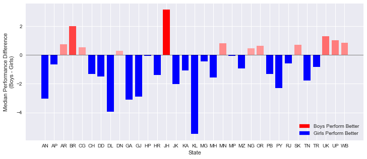

<!-- # National Achievement Survey of Class VIII students -->
## Introduction

This is a project based on a use case of [Gramener](https://gramener.com), a data science company. The aim is to identify the trends in 8th grade student performance based on National Achievement Survey by NCERT.

### About this report

This is a distilled version of analysis with the most significant insights about data. The orignial version with codes used to generate graphs can be found [**here**](/dsgramner/Analysis.html)

## Questions

Here we attempted to answer three most pertaining questions about data.

1. [What influences students performance the most?](#what-influences-students-performance-the-most)
2. [How do boys and girls perform across states?](#how-do-boys-and-girls-perform-across-states)
3. [Do students from South Indian states really excel at Math and Science?](#do-students-from-south-indian-states-really-excel-at-math-and-science)

### What influences students performance the most?

We defined an additional performance metric as 'performance' = average of ('Maths %', 'Reading %', 'Science %', 'Social %') to find which feature has the highest overall influence. A feature selection is performed and scores are calculated based on `SelectKBest` to evaluvate the relative importance of features. The top features were found for each category is given below.

|Parameter|Best Feature |
| --- |:--- |
|Overall Performance|'Father edu'|
|Maths|'Help in household'|
|Reading|'Mother edu'|
|Science|'Father edu'|
|Social|'Help in household'|

This concludeds that the education of parents were the most decisive predictor in deciding a student's  performance.

#### Factors influencing average performance

Here we describe the process by which we calculated the scores for performance. A simillar treatment is used for calculating scores in each category in ('Maths %', 'Reading %', 'Science %', 'Social %')

 Among top features, 'Father edu' has distinctly higher scores for performance, almost **33%** higher than the second feature indicating a very high relevance.

    count    180774.000000
    mean         38.095342
    std          14.949624
    min           0.000000
    25%          27.035000
    50%          35.640000
    75%          47.320000
    max         100.000000
    Name: performance, dtype: float64
    ======	Target Variable	: performance ======
    Best 5 Features:
     [('Father edu', 3906.8744966773766), 
     ('Mother edu', 3052.1893687615902), 
     ('Help in household', 2793.8799410412198), 
     ('Read other books', 2661.1779134014673), 
     ('Father occupation', 2428.0365114374408)]

Since father education has the highest score, we decided to plot the entire data set with 'Father edu' as a factor. The plot explains an upward trend in the median performance % of the students.

**Legend**

            Column                    Name Level          Rename
    24  Father edu        Degree and above     5  Degree & above
    25  Father edu              Illiterate     1      Illiterate
    26  Father edu          Not applicable     0  Not applicable
    27  Father edu           Primary level     2         Primary
    28  Father edu         Secondary level     3       Secondary
    29  Father edu  Senior secondary level     4    Sr secondary

### How do boys and girls perform across states?

Across various states Girls tend to have a higher median performance than boys.

Some states with notable exception to this rule is Jharkand (JH) and Bihar (BH). Since these state have high gender inequality, this trend could be due to lack of access to education to girls. To confirm, it has to be crosschecked with percentage of girls with access to education.

### Do students from South Indian states really excel at Math and Science?

To determine this, we considered southern states as : "Andhra Pradesh", "Kerala", "Karnataka" and "Tamil Nadu". Meanwhile other states are referred to "the rest of the country". The performance score for 'Science and Math' is defined as the mean value of both 'Science' and 'Math'. 

We found that central tendendencies of `Southern States` to be slight lower than rest of the country. But it should be noted that number of samples in the `Southern States` is far less. Also, it should be understood that the enrollment rate of southern states is usually higher than rest of country which could be driving down the median values.

To identify if all southern states follow this pattern, we split the data into corresponding southern state. We found that "Kerala" as a notable exception to the trend of southern states. "Kerala" tends to have higher median score than other southern states, rest of the country and the overall median of country. Another exception is the distribution of marks from "Tamil Nadu" with longer tails. "Tamil Nadu" followed the trend of the rest of the country with longer tails at highest end but has lower median score than all others.