* auto-gen TOC:
{:toc}

## Questions

1. What influences students performance the most?
2. How do boys and girls perform across states?
3. Do students from South Indian states really excel at Math and Science?

## Data Exploration


```python
# loading dataset
import pandas as pd
import numpy as np
import matplotlib.pyplot as plt
%matplotlib inline
plt.style.use('ggplot')

# suppress all warnings
import warnings
warnings.filterwarnings('ignore')


marks = pd.read_csv('gramener-usecase-nas/nas-pupil-marks.csv')
labels = pd.read_csv('gramener-usecase-nas/nas-labels.csv')
```


```python
marks.head(3)
```


<div>
<style>
    .dataframe thead tr:only-child th {
        text-align: right;
    }

    .dataframe thead th {
        text-align: left;
    }

    .dataframe tbody tr th {
        vertical-align: top;
    }
</style>
<table border="1" class="dataframe">
  <thead>
    <tr style="text-align: right;">
      <th></th>
      <th>STUID</th>
      <th>State</th>
      <th>District</th>
      <th>Gender</th>
      <th>Age</th>
      <th>Category</th>
      <th>Same language</th>
      <th>Siblings</th>
      <th>Handicap</th>
      <th>Father edu</th>
      <th>...</th>
      <th>Express science views</th>
      <th>Watch TV</th>
      <th>Read magazine</th>
      <th>Read a book</th>
      <th>Play games</th>
      <th>Help in household</th>
      <th>Maths %</th>
      <th>Reading %</th>
      <th>Science %</th>
      <th>Social %</th>
    </tr>
  </thead>
  <tbody>
    <tr>
      <th>0</th>
      <td>11011001001</td>
      <td>AP</td>
      <td>1</td>
      <td>1</td>
      <td>3</td>
      <td>3</td>
      <td>1</td>
      <td>5</td>
      <td>2</td>
      <td>1</td>
      <td>...</td>
      <td>3</td>
      <td>3</td>
      <td>4</td>
      <td>3</td>
      <td>4</td>
      <td>4</td>
      <td>20.37</td>
      <td>NaN</td>
      <td>27.78</td>
      <td>NaN</td>
    </tr>
    <tr>
      <th>1</th>
      <td>11011001002</td>
      <td>AP</td>
      <td>1</td>
      <td>2</td>
      <td>3</td>
      <td>4</td>
      <td>2</td>
      <td>5</td>
      <td>2</td>
      <td>2</td>
      <td>...</td>
      <td>3</td>
      <td>4</td>
      <td>4</td>
      <td>3</td>
      <td>4</td>
      <td>4</td>
      <td>12.96</td>
      <td>NaN</td>
      <td>38.18</td>
      <td>NaN</td>
    </tr>
    <tr>
      <th>2</th>
      <td>11011001003</td>
      <td>AP</td>
      <td>1</td>
      <td>2</td>
      <td>3</td>
      <td>4</td>
      <td>2</td>
      <td>5</td>
      <td>2</td>
      <td>1</td>
      <td>...</td>
      <td>3</td>
      <td>4</td>
      <td>3</td>
      <td>3</td>
      <td>4</td>
      <td>4</td>
      <td>27.78</td>
      <td>70.0</td>
      <td>NaN</td>
      <td>NaN</td>
    </tr>
  </tbody>
</table>
<p>3 rows × 64 columns</p>
</div>


```python
# Column names of dataset
marks.columns
```


    Index(['STUID', 'State', 'District', 'Gender', 'Age', 'Category',
           'Same language', 'Siblings', 'Handicap', 'Father edu', 'Mother edu',
           'Father occupation', 'Mother occupation', 'Below poverty',
           'Use calculator', 'Use computer', 'Use Internet', 'Use dictionary',
           'Read other books', '# Books', 'Distance', 'Computer use',
           'Library use', 'Like school', 'Subjects', 'Give Lang HW',
           'Give Math HW', 'Give Scie HW', 'Give SoSc HW', 'Correct Lang HW',
           'Correct Math HW', 'Correct Scie HW', 'Correct SocS HW',
           'Help in Study', 'Private tuition', 'English is difficult',
           'Read English', 'Dictionary to learn', 'Answer English WB',
           'Answer English aloud', 'Maths is difficult', 'Solve Maths',
           'Solve Maths in groups', 'Draw geometry', 'Explain answers',
           'SocSci is difficult', 'Historical excursions', 'Participate in SocSci',
           'Small groups in SocSci', 'Express SocSci views',
           'Science is difficult', 'Observe experiments', 'Conduct experiments',
           'Solve science problems', 'Express science views', 'Watch TV',
           'Read magazine', 'Read a book', 'Play games', 'Help in household',
           'Maths %', 'Reading %', 'Science %', 'Social %'],
          dtype='object')


```python
# The shape of data
marks.shape
```


    (185348, 64)


```python
# Splitting the columns into independent categories and performance
category = ['State', 'District', 'Gender', 'Age', 'Category',
       'Same language', 'Siblings', 'Handicap', 'Father edu', 'Mother edu',
       'Father occupation', 'Mother occupation', 'Below poverty',
       'Use calculator', 'Use computer', 'Use Internet', 'Use dictionary',
       'Read other books', '# Books', 'Distance', 'Computer use',
       'Library use', 'Like school', 'Subjects', 'Give Lang HW',
       'Give Math HW', 'Give Scie HW', 'Give SoSc HW', 'Correct Lang HW',
       'Correct Math HW', 'Correct Scie HW', 'Correct SocS HW',
       'Help in Study', 'Private tuition', 'English is difficult',
       'Read English', 'Dictionary to learn', 'Answer English WB',
       'Answer English aloud', 'Maths is difficult', 'Solve Maths',
       'Solve Maths in groups', 'Draw geometry', 'Explain answers',
       'SocSci is difficult', 'Historical excursions', 'Participate in SocSci',
       'Small groups in SocSci', 'Express SocSci views',
       'Science is difficult', 'Observe experiments', 'Conduct experiments',
       'Solve science problems', 'Express science views', 'Watch TV',
       'Read magazine', 'Read a book', 'Play games', 'Help in household']
performance = ['Maths %', 'Reading %', 'Science %', 'Social %']

# unique values in each category
for c in category:
    print (c,":",marks[c].unique())
```

    State : ['AP' 'AR' 'BR' 'CG' 'DL' 'GA' 'GJ' 'HR' 'HP' 'JK' 'JH' 'KA' 'KL' 'MP' 'MH'
     'MN' 'MG' 'MZ' 'NG' 'OR' 'PB' 'RJ' 'SK' 'TN' 'TR' 'UP' 'UK' 'WB' 'AN' 'CH'
     'PY' 'DN' 'DD']
    District : [ 1  2  3  4  5  6  7  8  9 10 11 12 13 14 15 16 17 18 19 20 21 22 23 24 25
     26 27 28]
    Gender : [1 2 0]
    Age : [3 2 5 0 4 6 1]
    Category : [3 4 0 1 2]
    Same language : [1 2 0]
    Siblings : [5 4 2 3 1]
    Handicap : [2 0 1]
    Father edu : [1 2 3 0 4 5]
    Mother edu : [1 2 0 3 5 4]
    Father occupation : [3 7 0 5 2 4 1 8 6]
    Mother occupation : [3 5 2 0 1 6 4 7 8]
    Below poverty : [0 1 2]
    Use calculator : [1 2 0]
    Use computer : ['No' nan 'Yes']
    Use Internet : [1 2 0]
    Use dictionary : [2 1 0]
    Read other books : [2 1 0]
    # Books : [2 4 1 0 3]
    Distance : [1 2 3 4 0]
    Computer use : [2 3 1 5 4 0]
    Library use : [2 3 4 0 1 5]
    Like school : [2 1 0]
    Subjects : ['L' 'S' 'O' 'M' '0']
    Give Lang HW : [4 0 1 3 2]
    Give Math HW : [4 3 0 1 2]
    Give Scie HW : [3 4 0 2 1]
    Give SoSc HW : [3 4 0 2 1]
    Correct Lang HW : [4 1 2 3 0]
    Correct Math HW : [4 3 1 2 0]
    Correct Scie HW : [4 2 3 1 0]
    Correct SocS HW : [4 3 2 1 0]
    Help in Study : [2 1 0]
    Private tuition : [1 2 0]
    English is difficult : [3 1 2 0]
    Read English : [3 1 2 0]
    Dictionary to learn : [3 1 2 0]
    Answer English WB : [3 2 1 0]
    Answer English aloud : [2 3 1 0]
    Maths is difficult : [2 1 3 0]
    Solve Maths : [2 3 1 0]
    Solve Maths in groups : [3 2 1 0]
    Draw geometry : [1 3 2 0]
    Explain answers : [3 1 2 0]
    SocSci is difficult : [1 3 2 0]
    Historical excursions : [3 1 2 0]
    Participate in SocSci : [3 1 2 0]
    Small groups in SocSci : [2 3 1 0]
    Express SocSci views : [3 2 1 0]
    Science is difficult : [2 3 1 0]
    Observe experiments : [3 2 1 0]
    Conduct experiments : [3 2 0 1]
    Solve science problems : [3 1 2 0]
    Express science views : [3 1 2 0]
    Watch TV : [3 4 2 1 0]
    Read magazine : [4 3 1 2 0]
    Read a book : [3 2 4 1 0]
    Play games : [4 3 2 1 0]
    Help in household : [4 3 1 2 0]


### What influences students performance the most?

We defined a performance metric as 'performance' = average of ('Maths %', 'Reading %', 'Science %', 'Social %'). A feature selection is performed based on `SelectKBest` to evaluvate the relative importance in predicting performance. The top features were found for each subject as well as for average of all.

|Parameter|Best Feature |
| --- |:--- |
|Overall Performance|'Father edu'|
|Maths|'Help in household'|
|Reading|'Mother edu'|
|Science|'Father edu'|
|Social|'Help in household'|

This concludeds that the education of parents were the most decisive predictor in deciding a student's  performance. Among top features, 'Father edu' has distinctly higher scores for performance, almost **33%** higher than the second feature indicating a very high relevance.


```python
# adding performance column as the average of all scores
# np.nanmean is used across the horizontal axis to avoid "NaN" values to calculate mean.
marks["performance"]=marks[performance].apply(np.nanmean, axis=1)
marks["performance"].describe()
```


    count    180774.000000
    mean         38.095342
    std          14.949624
    min           0.000000
    25%          27.035000
    50%          35.640000
    75%          47.320000
    max         100.000000
    Name: performance, dtype: float64


```python
# no. of null values and corresponding columns
pd.isnull(marks).sum()[pd.isnull(marks).sum()!=0]
```


    Use computer    19162
    Maths %         92667
    Reading %       92077
    Science %       94356
    Social %        95777
    performance      4574
    dtype: int64


```python
# Plotting performance based on each category value in the dataframe

for c in category:
    marks.boxplot(column="performance", by=c,figsize=(8, 4))
    print (labels[labels["Column"]==c])
    plt.suptitle("")
    plt.show()
```

        Column Name Level                Rename
    208  State   AN    AN     Andaman & Nicobar
    209  State   AP    AP        Andhra Pradesh
    210  State   AR    AR     Arunachal Pradesh
    211  State   BR    BR                 Bihar
    212  State   CG    CG           Chattisgarh
    213  State   CH    CH            Chandigarh
    214  State   DD    DD           Daman & Diu
    215  State   DL    DL                 Delhi
    216  State   DN    DN  Dadra & Nagar Haveli
    217  State   GA    GA                   Goa
    218  State   GJ    GJ               Gujarat
    219  State   HP    HP      Himachal Pradesh
    220  State   HR    HR               Haryana
    221  State   JH    JH             Jharkhand
    222  State   JK    JK       Jammu & Kashmir
    223  State   KA    KA             Karnataka
    224  State   KL    KL                Kerala
    225  State   MG    MG             Meghalaya
    226  State   MH    MH           Maharashtra
    227  State   MN    MN               Manipur
    228  State   MP    MP        Madhya Pradesh
    229  State   MZ    MZ               Mizoram
    230  State   NG    NG              Nagaland
    231  State   OR    OR                Orissa
    232  State   PB    PB                Punjab
    233  State   PY    PY           Pondicherry
    234  State   RJ    RJ             Rajasthan
    235  State   SK    SK                Sikkim
    236  State   TN    TN            Tamil Nadu
    237  State   TR    TR               Tripura
    238  State   UK    UK           Uttarakhand
    239  State   UP    UP         Uttar Pradesh
    240  State   WB    WB           West Bengal


    Empty DataFrame
    Columns: [Column, Name, Level, Rename]
    Index: []


       Column  Name Level Rename
    0  Gender   Boy     1    Boy
    1  Gender  Girl     2   Girl


      Column                Name Level     Rename
    2    Age            12 years     2   12 years
    3    Age            13 years     3   13 years
    4    Age            14 years     4   14 years
    5    Age            15 years     5   15 years
    6    Age  16 years and above     6  16+ years
    7    Age       Upto 11 years     1  11- years


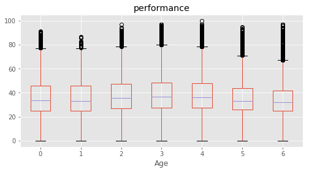


          Column Name Level Rename
    8   Category    0     0      0
    9   Category    1     1      1
    10  Category    2     2      2
    11  Category    3     3      3
    12  Category    4     4      4


               Column Name Level Rename
    13  Same language    0     0      0
    14  Same language    1     1      1
    15  Same language    2     2      2


          Column                 Name Level        Rename
    16  Siblings            1 sibling     1     1 sibling
    17  Siblings            2 sibling     2    2 siblings
    18  Siblings            3 sibling     3    3 siblings
    19  Siblings  4 and above sibling     4   4+ siblings
    20  Siblings         Single Child     0  Single child


          Column Name Level   Rename
    21  Handicap    0     0  Unknown
    22  Handicap    1     1      Yes
    23  Handicap    2     2       No


            Column                    Name Level          Rename
    24  Father edu        Degree and above     5  Degree & above
    25  Father edu              Illiterate     1      Illiterate
    26  Father edu          Not applicable     0  Not applicable
    27  Father edu           Primary level     2         Primary
    28  Father edu         Secondary level     3       Secondary
    29  Father edu  Senior secondary level     4    Sr secondary


            Column                    Name Level          Rename
    30  Mother edu        Degree and above     5  Degree & above
    31  Mother edu              Illiterate     1      Illiterate
    32  Mother edu          Not applicable     0  Not applicable
    33  Mother edu           Primary level     2         Primary
    34  Mother edu         Secondary level     3       Secondary
    35  Mother edu  Senior secondary level     4    Sr secondary


                   Column                                 Name Level  \
    36  Father occupation                                Clerk     4   
    37  Father occupation                          Do not know     0   
    38  Father occupation                               Farmer     3   
    39  Father occupation                             Labourer     2   
    40  Father occupation  Manager/Senior Officer/Professional     8   
    41  Father occupation              Shopkeeper/ Businessman     6   
    42  Father occupation                       Skilled Worker     5   
    43  Father occupation           Teacher/Lecturer/Professor     7   
    44  Father occupation                           Unemployed     1   
    
                  Rename  
    36             Clerk  
    37       Do not know  
    38            Farmer  
    39          Labourer  
    40      Professional  
    41          Business  
    42    Skilled Worker  
    43  Teacher/Lecturer  
    44        Unemployed  


                   Column                                 Name Level  \
    45  Mother occupation                                Clerk     4   
    46  Mother occupation                          Do not know     0   
    47  Mother occupation                               Farmer     3   
    48  Mother occupation                             Labourer     2   
    49  Mother occupation  Manager/Senior Officer/Professional     8   
    50  Mother occupation              Shopkeeper/ Businessman     6   
    51  Mother occupation                       Skilled Worker     5   
    52  Mother occupation           Teacher/Lecturer/Professor     7   
    53  Mother occupation                           Unemployed     1   
    
                  Rename  
    45             Clerk  
    46       Do not know  
    47            Farmer  
    48          Labourer  
    49      Professional  
    50          Business  
    51    Skilled Worker  
    52  Teacher/Lecturer  
    53        Unemployed  


               Column        Name Level      Rename
    54  Below poverty  Don't know     0  Don't know
    55  Below poverty          No     1          No
    56  Below poverty         Yes     2         Yes


                Column Name Level Rename
    57  Use calculator   No     1     No
    58  Use calculator  Yes     2    Yes
    59  Use calculator   No     1     No
    60  Use calculator  Yes     2    Yes


    Empty DataFrame
    Columns: [Column, Name, Level, Rename]
    Index: []


              Column Name Level Rename
    61  Use Internet   No     1     No
    62  Use Internet  Yes     2    Yes


                Column Name Level Rename
    63  Use dictionary   No     1     No
    64  Use dictionary  Yes     2    Yes


                  Column Name Level Rename
    65  Read other books   No     1     No
    66  Read other books  Yes     2    Yes


         Column                Name Level        Rename
    67  # Books        11to25 books     3  11-125 books
    68  # Books         1to10 books     2    1-10 books
    69  # Books  More than 25 books     4     25+ books
    70  # Books            No books     1      No books


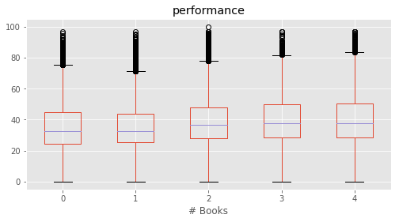


          Column                 Name Level          Rename
    71  Distance  More than 1 to 3 km     2          1-3 km
    72  Distance  More than 3 to 5 km     3          3-5 km
    73  Distance       More than 5 km     4  More than 5 km
    74  Distance           Up to 1 km     1      Up to 1 km


              Column                Name Level          Rename
    75  Computer use               Daily     5           Daily
    76  Computer use         No computer     1     No computer
    77  Computer use      Once in a week     4  Once in a week
    78  Computer use       Once in month     3   Once in month
    79  Computer use  Yes, but never use     2       Never use


             Column                      Name Level                    Rename
    80  Library use  More than once in a week     5  More than once in a week
    81  Library use                No library     1                No library
    82  Library use            Once in a week     4            Once in a week
    83  Library use  Once or twice in a month     3  Once or twice in a month
    84  Library use        Yes, but never use     2                 Never use


             Column Name Level Rename
    85  Like school   No     1     No
    86  Like school  Yes     2    Yes


          Column            Name Level          Rename
    87  Subjects        Language     L        Language
    88  Subjects     Mathematics     M     Mathematics
    89  Subjects            None     0            None
    90  Subjects         Science     S         Science
    91  Subjects  Social Science     O  Social Science


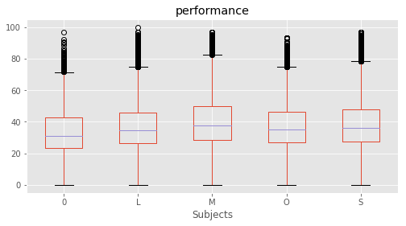


              Column               Name Level            Rename
    92  Give Lang HW  1or2 times a week     2  1-2 times a week
    93  Give Lang HW  3or4 times a week     3  3-4 times a week
    94  Give Lang HW           Everyday     4          Everyday
    95  Give Lang HW              Never     1             Never


              Column               Name Level            Rename
    96  Give Math HW  1or2 times a week     2  1-2 times a week
    97  Give Math HW  3or4 times a week     3  3-4 times a week
    98  Give Math HW           Everyday     4          Everyday
    99  Give Math HW              Never     1             Never


               Column               Name Level            Rename
    100  Give Scie HW  1or2 times a week     2  1-2 times a week
    101  Give Scie HW  3or4 times a week     3  3-4 times a week
    102  Give Scie HW           Everyday     4          Everyday
    103  Give Scie HW              Never     1             Never


               Column               Name Level            Rename
    104  Give SoSc HW  1or2 times a week     2  1-2 times a week
    105  Give SoSc HW  3or4 times a week     3  3-4 times a week
    106  Give SoSc HW           Everyday     4          Everyday
    107  Give SoSc HW              Never     1             Never


                  Column                Name Level            Rename
    108  Correct Lang HW  1 or2 times a week     2  1-2 times a week
    109  Correct Lang HW  3 or4 times a week     3  3-4 times a week
    110  Correct Lang HW            Everyday     4          Everyday
    111  Correct Lang HW               Never     1             Never


                  Column                Name Level            Rename
    112  Correct Math HW  1 or2 times a week     2  1-2 times a week
    113  Correct Math HW  3 or4 times a week     3  3-4 times a week
    114  Correct Math HW            Everyday     4          Everyday
    115  Correct Math HW               Never     1             Never


                  Column                Name Level            Rename
    116  Correct Scie HW  1 or2 times a week     2  1-2 times a week
    117  Correct Scie HW  3 or4 times a week     3  3-4 times a week
    118  Correct Scie HW            Everyday     4          Everyday
    119  Correct Scie HW               Never     1             Never


                  Column                Name Level            Rename
    120  Correct SocS HW  1 or2 times a week     2  1-2 times a week
    121  Correct SocS HW  3 or4 times a week     3  3-4 times a week
    122  Correct SocS HW            Everyday     4          Everyday
    123  Correct SocS HW               Never     1             Never


                Column Name Level Rename
    124  Help in Study   No     1     No
    125  Help in Study  Yes     2    Yes


                  Column Name Level Rename
    126  Private tuition   No     1     No
    127  Private tuition  Yes     2    Yes


                       Column                       Name Level    Rename
    128  English is difficult                      Agree     3     Agree
    129  English is difficult                   Disagree     1  Disagree
    130  English is difficult  Neither agree or disagree     2   Neither


               Column                       Name Level    Rename
    131  Read English                      Agree     3     Agree
    132  Read English                   Disagree     1  Disagree
    133  Read English  Neither agree or disagree     2   Neither


                      Column                       Name Level    Rename
    134  Dictionary to learn                      Agree     3     Agree
    135  Dictionary to learn                   Disagree     1  Disagree
    136  Dictionary to learn  Neither agree or disagree     2   Neither


                    Column                       Name Level    Rename
    137  Answer English WB                      Agree     3     Agree
    138  Answer English WB                   Disagree     1  Disagree
    139  Answer English WB  Neither agree or disagree     2   Neither


                       Column                       Name Level    Rename
    140  Answer English aloud                      Agree     3     Agree
    141  Answer English aloud                   Disagree     1  Disagree
    142  Answer English aloud  Neither agree or disagree     2   Neither


                     Column                       Name Level    Rename
    143  Maths is difficult                      Agree     3     Agree
    144  Maths is difficult                   Disagree     1  Disagree
    145  Maths is difficult  Neither agree or disagree     2   Neither


              Column                       Name Level    Rename
    146  Solve Maths                      Agree     3     Agree
    147  Solve Maths                   Disagree     1  Disagree
    148  Solve Maths  Neither agree or disagree     2   Neither


                        Column                       Name Level    Rename
    149  Solve Maths in groups                      Agree     3     Agree
    150  Solve Maths in groups                   Disagree     1  Disagree
    151  Solve Maths in groups  Neither agree or disagree     2   Neither


                Column                       Name Level    Rename
    152  Draw geometry                      Agree     3     Agree
    153  Draw geometry                   Disagree     1  Disagree
    154  Draw geometry  Neither agree or disagree     2   Neither


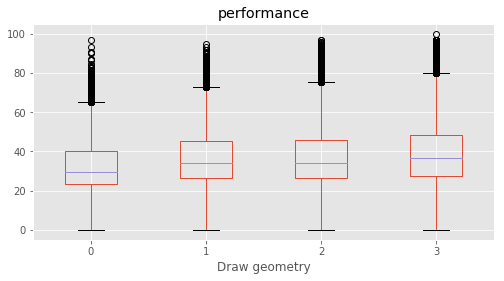


                  Column                       Name Level    Rename
    155  Explain answers                      Agree     3     Agree
    156  Explain answers                   Disagree     1  Disagree
    157  Explain answers  Neither agree or disagree     2   Neither


                      Column                       Name Level    Rename
    158  SocSci is difficult                      Agree     3     Agree
    159  SocSci is difficult                   Disagree     1  Disagree
    160  SocSci is difficult  Neither agree or disagree     2   Neither


                        Column                       Name Level    Rename
    161  Historical excursions                      Agree     3     Agree
    162  Historical excursions                   Disagree     1  Disagree
    163  Historical excursions  Neither agree or disagree     2   Neither


                        Column                       Name Level    Rename
    164  Participate in SocSci                      Agree     3     Agree
    165  Participate in SocSci                   Disagree     1  Disagree
    166  Participate in SocSci  Neither agree or disagree     2   Neither


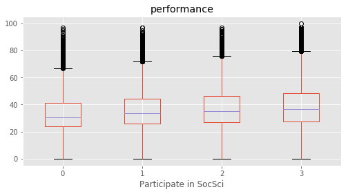


                         Column                       Name Level    Rename
    167  Small groups in SocSci                      Agree     3     Agree
    168  Small groups in SocSci                   Disagree     1  Disagree
    169  Small groups in SocSci  Neither agree or disagree     2   Neither


                       Column                       Name Level    Rename
    170  Express SocSci views                      Agree     3     Agree
    171  Express SocSci views                   Disagree     1  Disagree
    172  Express SocSci views  Neither agree or disagree     2   Neither


                       Column                       Name Level    Rename
    173  Science is difficult                      Agree     3     Agree
    174  Science is difficult                   Disagree     1  Disagree
    175  Science is difficult  Neither agree or disagree     2   Neither


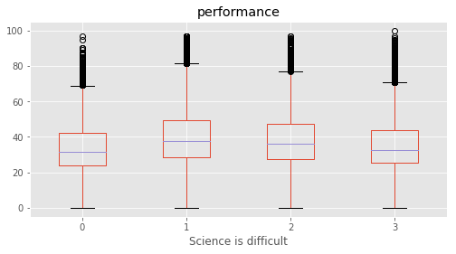


                      Column                       Name Level    Rename
    176  Observe experiments                      Agree     3     Agree
    177  Observe experiments                   Disagree     1  Disagree
    178  Observe experiments  Neither agree or disagree     2   Neither


                      Column                       Name Level    Rename
    179  Conduct experiments                      Agree     3     Agree
    180  Conduct experiments                   Disagree     1  Disagree
    181  Conduct experiments  Neither agree or disagree     2   Neither


                         Column                       Name Level    Rename
    182  Solve science problems                      Agree     3     Agree
    183  Solve science problems                   Disagree     1  Disagree
    184  Solve science problems  Neither agree or disagree     2   Neither


                        Column                       Name Level    Rename
    185  Express science views                      Agree     3     Agree
    186  Express science views                   Disagree     1  Disagree
    187  Express science views  Neither agree or disagree     2   Neither


           Column          Name Level        Rename
    188  Watch TV     Every day     4     Every day
    189  Watch TV         Never     1         Never
    190  Watch TV  Once a month     2  Once a month
    191  Watch TV   Once a week     3   Once a week


                Column          Name Level        Rename
    192  Read magazine     Every day     4     Every day
    193  Read magazine         Never     1         Never
    194  Read magazine  Once a month     2  Once a month
    195  Read magazine   Once a week     3   Once a week


              Column          Name Level        Rename
    196  Read a book     Every day     4     Every day
    197  Read a book         Never     1         Never
    198  Read a book  Once a month     2  Once a month
    199  Read a book   Once a week     3   Once a week


             Column          Name Level        Rename
    200  Play games     Every day     4     Every day
    201  Play games         Never     1         Never
    202  Play games  Once a month     2  Once a month
    203  Play games   Once a week     3   Once a week


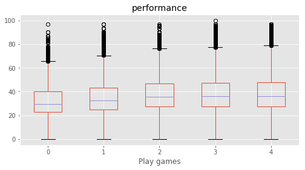


                    Column          Name Level        Rename
    204  Help in household     Every day     4     Every day
    205  Help in household         Never     1         Never
    206  Help in household  Once a month     2  Once a month
    207  Help in household   Once a week     3   Once a week


```python
def clean_data(marks, y_col_name="performance"):
    # Creating traning set X and target y
    from sklearn.preprocessing import LabelEncoder

    # Remove all rows with performance is undefined i.e. "NaN" 
    marks_nona = marks.dropna(subset=[y_col_name])

    # Cloning marks to make a training set X
    X = marks_nona[category].copy(deep=True)

    # string encoded columns are converted to np array to create training set x
    encoded_columns = ["State","Use computer", "Subjects"]
    le_state = LabelEncoder()
    le_subject = LabelEncoder()
    le_use_comp = LabelEncoder()
    X["State"] = le_state.fit_transform(X["State"])
    X["Subjects"] = le_subject.fit_transform(X["Subjects"])
    X["Use computer"] = le_use_comp.fit_transform(X["Use computer"].fillna(value="0"))

    print("Shape of X\t:",X.shape)

    # target variable y 
    y = marks_nona[y_col_name]
    print ("Shape of y\t:",y.shape)
    return X, y
```


```python
def best_features(X,y):
    # Pipeline is defined for feature selection
    from sklearn.feature_selection import SelectKBest,f_regression,mutual_info_regression
    from sklearn.pipeline import Pipeline
    from sklearn.preprocessing import StandardScaler

    pipe = Pipeline(steps = [('scaler', StandardScaler()),\
                                ('selK', SelectKBest(k="all",score_func=f_regression))])
    pipe.fit(X.astype(float).values,y.astype(float).values)

    # score of top 10 features is sorted in descending order
    k_scores = pipe.named_steps["selK"].scores_
#     k_scores = k_scores/sum(k_scores)
    scores_tuple = zip(X.columns,k_scores)
    sorted_scores = sorted(scores_tuple,key=lambda score:score[1], reverse=True)
    print ("Best 5 Features:\n",sorted_scores[:5])
    
    # Plotting the best features
    fig=plt.figure(figsize=(12,5))
    plt.bar(np.arange(len(k_scores)),k_scores,label = X.columns)
    plt.axhline(y=max(k_scores)*0.6,color='b',linewidth=.5)
    plt.xticks(np.arange(len(k_scores)),X.columns,rotation="vertical")
    plt.ylabel("K-Scores")
    plt.show()
    
    return sorted_scores

def tuple_to_dict(scores_tuple):
    """
    converts an array of tuple (key,value) to a dictionary {key:value}
    """
    i = 0;
    my_dict = {}
    while i<len(scores_tuple):
        key, value = scores_tuple[i]
        my_dict.update({key : value})
        i = i+1
    return my_dict
    
```


```python
target = ["performance","Maths %","Reading %","Science %","Social %"]
final_stat = {}

for t in target:
    print("======\tTarget Variable\t:",t,"======")
    X, y = clean_data(marks,y_col_name=t)
    sorted_scores = best_features(X,y)
    final_stat.update({t : tuple_to_dict(sorted_scores)})
    best_f = sorted_scores[0][0]
    
    # plotting
    marks.boxplot(column=t, by=best_f,figsize=(8,5))
    plt.title(t)
    plt.tight_layout()
    plt.suptitle("")
    print (labels[labels["Column"]==best_f])
    plt.show()
```

    ======	Target Variable	: performance ======
    Shape of X	: (180774, 59)
    Shape of y	: (180774,)
    Best 5 Features:
     [('Father edu', 3906.8744966773766), ('Mother edu', 3052.1893687615902), ('Help in household', 2793.8799410412198), ('Read other books', 2661.1779134014673), ('Father occupation', 2428.0365114374408)]


            Column                    Name Level          Rename
    24  Father edu        Degree and above     5  Degree & above
    25  Father edu              Illiterate     1      Illiterate
    26  Father edu          Not applicable     0  Not applicable
    27  Father edu           Primary level     2         Primary
    28  Father edu         Secondary level     3       Secondary
    29  Father edu  Senior secondary level     4    Sr secondary


    ======	Target Variable	: Maths % ======
    Shape of X	: (92681, 59)
    Shape of y	: (92681,)
    Best 5 Features:
     [('Help in household', 914.12688336032204), ('Computer use', 651.62580084653632), ('Dictionary to learn', 610.29101679041355), ('Maths is difficult', 556.06941787824678), ('Solve science problems', 526.11708504368846)]


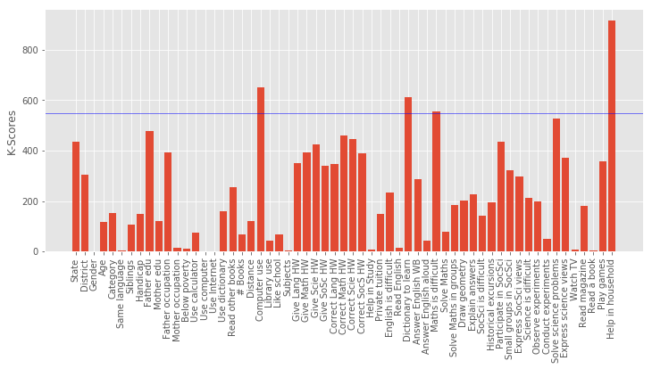


                    Column          Name Level        Rename
    204  Help in household     Every day     4     Every day
    205  Help in household         Never     1         Never
    206  Help in household  Once a month     2  Once a month
    207  Help in household   Once a week     3   Once a week


    ======	Target Variable	: Reading % ======
    Shape of X	: (93271, 59)
    Shape of y	: (93271,)
    Best 5 Features:
     [('Mother edu', 3424.4980512295078), ('Father edu', 3329.8749927211034), ('Use dictionary', 2309.8832945874847), ('Read other books', 2200.3369324634891), ('# Books', 1922.4965853283888)]


            Column                    Name Level          Rename
    30  Mother edu        Degree and above     5  Degree & above
    31  Mother edu              Illiterate     1      Illiterate
    32  Mother edu          Not applicable     0  Not applicable
    33  Mother edu           Primary level     2         Primary
    34  Mother edu         Secondary level     3       Secondary
    35  Mother edu  Senior secondary level     4    Sr secondary


    ======	Target Variable	: Science % ======
    Shape of X	: (90992, 59)
    Shape of y	: (90992,)
    Best 5 Features:
     [('Father edu', 1227.5175152615805), ('Help in household', 1024.425737832905), ('Mother edu', 985.68094452340586), ('Read other books', 960.69082698717637), ('Father occupation', 887.2845094505285)]


            Column                    Name Level          Rename
    24  Father edu        Degree and above     5  Degree & above
    25  Father edu              Illiterate     1      Illiterate
    26  Father edu          Not applicable     0  Not applicable
    27  Father edu           Primary level     2         Primary
    28  Father edu         Secondary level     3       Secondary
    29  Father edu  Senior secondary level     4    Sr secondary


    ======	Target Variable	: Social % ======
    Shape of X	: (89571, 59)
    Shape of y	: (89571,)
    Best 5 Features:
     [('Help in household', 1953.6981406711302), ('Father edu', 1042.1749875474054), ('Read other books', 862.49475538243018), ('Solve science problems', 843.71858538199774), ('Express science views', 771.77171134892569)]


                    Column          Name Level        Rename
    204  Help in household     Every day     4     Every day
    205  Help in household         Never     1         Never
    206  Help in household  Once a month     2  Once a month
    207  Help in household   Once a week     3   Once a week


```python
# K-scores are normalized by maximum score (along each row) to show the strongest predictor for each row
import seaborn as sns
s = pd.DataFrame.from_dict(final_stat, orient='index')
final = s.divide(s.max(axis=1),axis = 0)

# plotting heat map 
plt.figure(figsize=(15,2))
f = sns.heatmap(final, linewidths = 1,square= False, cbar= False, vmin=0.2)
plt.suptitle("Coloring based on K-Score (Darker color indicates stonger influence)")
plt.show()
```


### How do boys and girls perform across states?

Across most states Girls tend to have a higher median performance than boys.

Some states with notable exception to this rule are Jharkand (JH) and Bihar (BH). Since these state have high gender inequality, this trend could be due to lack of access/support to educational resources to girls compared to boys. There could be other intrinsic reasons as it needs additional supporting data.

Of the states where girls perform better, Kerala and Delhi stands out. Both states showed that median performance of girls is almost 4% higher than boys.


```python
# Eliminating Gender not equal to 1 or 2
marks_gender = marks.dropna(subset=["performance"])
marks_gender =marks_gender[marks_gender["Gender"]!=0]
marks_gender.boxplot(column="performance", by=["State","Gender"], figsize=(12, 3))
plt.xticks(rotation="vertical")
plt.show()
```


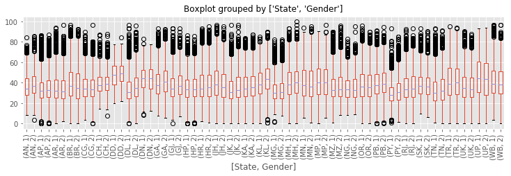


```python
# Aggregating median performance based on "State" and "Gender"
G_perfomance = marks_gender.groupby(["State","Gender"]).median()["performance"].reset_index()

# pivoting the dataframe to include columns "Boy" and "Girl" and renaming them
G_perfomance = G_perfomance.pivot(index='State', columns='Gender', values='performance')
G_perfomance.columns = ["Boy","Girl"]

# Adding column "diff" with the differenc ein median performance of boys and girls
G_perfomance["diff"]=G_perfomance["Boy"]-G_perfomance["Girl"]

G_perfomance.head()
```


<div>
<style>
    .dataframe thead tr:only-child th {
        text-align: right;
    }

    .dataframe thead th {
        text-align: left;
    }

    .dataframe tbody tr th {
        vertical-align: top;
    }
</style>
<table border="1" class="dataframe">
  <thead>
    <tr style="text-align: right;">
      <th></th>
      <th>Boy</th>
      <th>Girl</th>
      <th>diff</th>
    </tr>
    <tr>
      <th>State</th>
      <th></th>
      <th></th>
      <th></th>
    </tr>
  </thead>
  <tbody>
    <tr>
      <th>AN</th>
      <td>34.0550</td>
      <td>37.10125</td>
      <td>-3.04625</td>
    </tr>
    <tr>
      <th>AP</th>
      <td>32.0000</td>
      <td>32.65500</td>
      <td>-0.65500</td>
    </tr>
    <tr>
      <th>AR</th>
      <td>32.0875</td>
      <td>31.33500</td>
      <td>0.75250</td>
    </tr>
    <tr>
      <th>BR</th>
      <td>37.0000</td>
      <td>35.00000</td>
      <td>2.00000</td>
    </tr>
    <tr>
      <th>CG</th>
      <td>33.9825</td>
      <td>33.45500</td>
      <td>0.52750</td>
    </tr>
  </tbody>
</table>
</div>


```python
# Aggregating count of Gender based on "State" and "Gender"
G_count = marks_gender.groupby(["State","Gender"]).count()[["STUID"]].reset_index()

# pivoting the dataframe to include columns "Boy" and "Girl" and renaming them
G_count = G_count.pivot(index='State', columns='Gender', values='STUID')
G_count.columns = ["Boy","Girl"]
G_count["ratio"] = G_count["Boy"]/G_count["Boy"]
G_count.head()
```


<div>
<style>
    .dataframe thead tr:only-child th {
        text-align: right;
    }

    .dataframe thead th {
        text-align: left;
    }

    .dataframe tbody tr th {
        vertical-align: top;
    }
</style>
<table border="1" class="dataframe">
  <thead>
    <tr style="text-align: right;">
      <th></th>
      <th>Boy</th>
      <th>Girl</th>
      <th>ratio</th>
    </tr>
    <tr>
      <th>State</th>
      <th></th>
      <th></th>
      <th></th>
    </tr>
  </thead>
  <tbody>
    <tr>
      <th>AN</th>
      <td>971</td>
      <td>956</td>
      <td>1.0</td>
    </tr>
    <tr>
      <th>AP</th>
      <td>3450</td>
      <td>4093</td>
      <td>1.0</td>
    </tr>
    <tr>
      <th>AR</th>
      <td>2438</td>
      <td>2543</td>
      <td>1.0</td>
    </tr>
    <tr>
      <th>BR</th>
      <td>3407</td>
      <td>3757</td>
      <td>1.0</td>
    </tr>
    <tr>
      <th>CG</th>
      <td>3346</td>
      <td>3401</td>
      <td>1.0</td>
    </tr>
  </tbody>
</table>
</div>


```python
import matplotlib.colors as colors
from matplotlib.cm import bwr as cmap
import matplotlib.patches as mpatches

plt.figure(figsize=(12,5))

# setting colors. Maps the max and min values in "diff" to a color map bwr
c_normal = colors.PowerNorm(.1,vmin=min(G_perfomance["diff"]), vmax=max(G_perfomance["diff"]))
_COLORS = cmap(c_normal(G_perfomance["diff"]))

plt.bar(np.arange(len(G_perfomance["diff"])), 
        height = G_perfomance["diff"], width = 0.75, align = "center",\
        color=_COLORS)
plt.xticks(np.arange(len(G_perfomance.index)),list(G_perfomance.index))
plt.axhline(0, color='k', linewidth = 0.5)
plt.xlabel("State")
plt.ylabel("Median Performance Difference\n(Boys - Girls)")

# creating legend patches
red_patch = mpatches.Patch(color='red', label='Boys Perform Better')
blue_patch = mpatches.Patch(color='blue', label='Girls Perform Better')
plt.legend(handles=[red_patch, blue_patch], loc=4)

plt.show()
```


```python
fig = plt.figure(figsize = (5,14),dpi=100)

ax = fig.add_subplot(111)
ax2 = ax.twiny()

# bar plots on first axis ax
ax.barh(np.arange(len(G_perfomance["Boy"])),\
         width = G_perfomance["Boy"],height = 0.1, color="k",\
        align = "center", alpha =0.25, linewidth = 0)
ax.barh(np.arange(len(G_perfomance["Girl"])),\
         width = -G_perfomance["Girl"],height = 0.1, color="k",\
        align = "center", alpha =0.25, linewidth = 0)

# scatter plots on first axis ax with marker size mapped on to sampe size
ax.scatter(x = G_perfomance["Boy"],\
            y = np.arange(len(G_perfomance["diff"])),\
            s = G_count["Boy"]*0.1,\
            color = "k", alpha =0.5)
ax.scatter(x = -G_perfomance["Girl"],\
            y = np.arange(len(G_perfomance["diff"])),\
            s = G_count["Girl"]*0.1,\
            color = "k", alpha =0.5)


# First x-axis
ax.set_xlim(-60, 60)
ax.set_xticklabels([str(abs(x)) for x in ax.get_xticks()]) # changing the x ticks to remove "-"
ax.set_xlabel("Median performance")

for a in [100,500]:
    ax.scatter([],[],c='k', alpha=0.5, s=a,label = "{0}".format(a*10))

# Second x-axis
ax2.barh(np.arange(len(G_perfomance["diff"])), 
        width = G_perfomance["diff"], height = 0.75, align = "center",\
        color=_COLORS)

ax2.set_xlim(-10, 10)
ax2.grid(False)
ax2.set_xlabel("Median performance difference (Boys - Girls)")

# y-axis
ax.set_ylim(-1, len(G_perfomance.index)+2)
plt.yticks(np.arange(len(G_perfomance.index)),list(G_perfomance.index))
plt.axvline(x= 0, color='k', linewidth = 0.75, ymax = 0.94)

# legend
red_patch = mpatches.Patch(color='red', label='Boys Perform Better')
blue_patch = mpatches.Patch(color='blue', label='Girls Perform Better')
plt.legend(handles=[blue_patch, red_patch], loc=2, ncol =1, mode = "expand")
ax.legend(loc=1,ncol=2)


# annotation patch
tboy = ax.text(50, -2.2, "Boys", ha="center", va="center", rotation=0,
            size=10,color = "w",
            bbox=dict(boxstyle="rarrow,pad=0.3", fc="grey", ec="b", lw=0))
tgirl = ax.text(-50, -2.2, "Girls", ha="center", va="center", rotation=0,
            size=10,color = "w",
            bbox=dict(boxstyle="larrow,pad=0.3", fc="grey", ec="b", lw=0))

plt.show()
```


```python
# Sorted list of States with higher performance for Boys
G_perfomance[G_perfomance["diff"]>0].sort_values("diff", ascending=False)
```


<div>
<style>
    .dataframe thead tr:only-child th {
        text-align: right;
    }

    .dataframe thead th {
        text-align: left;
    }

    .dataframe tbody tr th {
        vertical-align: top;
    }
</style>
<table border="1" class="dataframe">
  <thead>
    <tr style="text-align: right;">
      <th></th>
      <th>Boy</th>
      <th>Girl</th>
      <th>diff</th>
    </tr>
    <tr>
      <th>State</th>
      <th></th>
      <th></th>
      <th></th>
    </tr>
  </thead>
  <tbody>
    <tr>
      <th>JH</th>
      <td>38.335000</td>
      <td>35.1925</td>
      <td>3.142500</td>
    </tr>
    <tr>
      <th>BR</th>
      <td>37.000000</td>
      <td>35.0000</td>
      <td>2.000000</td>
    </tr>
    <tr>
      <th>UK</th>
      <td>34.965000</td>
      <td>33.6750</td>
      <td>1.290000</td>
    </tr>
    <tr>
      <th>UP</th>
      <td>44.365000</td>
      <td>43.3350</td>
      <td>1.030000</td>
    </tr>
    <tr>
      <th>WB</th>
      <td>39.165000</td>
      <td>38.3350</td>
      <td>0.830000</td>
    </tr>
    <tr>
      <th>MN</th>
      <td>37.275000</td>
      <td>36.4650</td>
      <td>0.810000</td>
    </tr>
    <tr>
      <th>AR</th>
      <td>32.087500</td>
      <td>31.3350</td>
      <td>0.752500</td>
    </tr>
    <tr>
      <th>SK</th>
      <td>36.777500</td>
      <td>36.0700</td>
      <td>0.707500</td>
    </tr>
    <tr>
      <th>OR</th>
      <td>36.370000</td>
      <td>35.7400</td>
      <td>0.630000</td>
    </tr>
    <tr>
      <th>CG</th>
      <td>33.982500</td>
      <td>33.4550</td>
      <td>0.527500</td>
    </tr>
    <tr>
      <th>NG</th>
      <td>33.275000</td>
      <td>32.8100</td>
      <td>0.465000</td>
    </tr>
    <tr>
      <th>DN</th>
      <td>44.436667</td>
      <td>44.1400</td>
      <td>0.296667</td>
    </tr>
  </tbody>
</table>
</div>


```python
# Sorted list of States with higher performance for Girls
G_perfomance[G_perfomance["diff"]<0].sort_values("diff", ascending=True)
```


<div>
<style>
    .dataframe thead tr:only-child th {
        text-align: right;
    }

    .dataframe thead th {
        text-align: left;
    }

    .dataframe tbody tr th {
        vertical-align: top;
    }
</style>
<table border="1" class="dataframe">
  <thead>
    <tr style="text-align: right;">
      <th></th>
      <th>Boy</th>
      <th>Girl</th>
      <th>diff</th>
    </tr>
    <tr>
      <th>State</th>
      <th></th>
      <th></th>
      <th></th>
    </tr>
  </thead>
  <tbody>
    <tr>
      <th>KL</th>
      <td>38.2950</td>
      <td>43.79500</td>
      <td>-5.50000</td>
    </tr>
    <tr>
      <th>DL</th>
      <td>31.0700</td>
      <td>35.00000</td>
      <td>-3.93000</td>
    </tr>
    <tr>
      <th>GA</th>
      <td>37.7250</td>
      <td>40.83500</td>
      <td>-3.11000</td>
    </tr>
    <tr>
      <th>AN</th>
      <td>34.0550</td>
      <td>37.10125</td>
      <td>-3.04625</td>
    </tr>
    <tr>
      <th>GJ</th>
      <td>34.1050</td>
      <td>36.99000</td>
      <td>-2.88500</td>
    </tr>
    <tr>
      <th>PY</th>
      <td>28.2850</td>
      <td>30.60000</td>
      <td>-2.31500</td>
    </tr>
    <tr>
      <th>JK</th>
      <td>30.8450</td>
      <td>32.85500</td>
      <td>-2.01000</td>
    </tr>
    <tr>
      <th>TN</th>
      <td>30.1800</td>
      <td>31.95000</td>
      <td>-1.77000</td>
    </tr>
    <tr>
      <th>MH</th>
      <td>38.5050</td>
      <td>40.07000</td>
      <td>-1.56500</td>
    </tr>
    <tr>
      <th>DD</th>
      <td>47.5925</td>
      <td>49.10500</td>
      <td>-1.51250</td>
    </tr>
    <tr>
      <th>HR</th>
      <td>34.4300</td>
      <td>35.83500</td>
      <td>-1.40500</td>
    </tr>
    <tr>
      <th>CH</th>
      <td>37.8650</td>
      <td>39.18750</td>
      <td>-1.32250</td>
    </tr>
    <tr>
      <th>PB</th>
      <td>37.8575</td>
      <td>39.18000</td>
      <td>-1.32250</td>
    </tr>
    <tr>
      <th>KA</th>
      <td>34.3650</td>
      <td>35.45500</td>
      <td>-1.09000</td>
    </tr>
    <tr>
      <th>MZ</th>
      <td>32.8200</td>
      <td>33.77000</td>
      <td>-0.95000</td>
    </tr>
    <tr>
      <th>TR</th>
      <td>39.1650</td>
      <td>40.00000</td>
      <td>-0.83500</td>
    </tr>
    <tr>
      <th>AP</th>
      <td>32.0000</td>
      <td>32.65500</td>
      <td>-0.65500</td>
    </tr>
    <tr>
      <th>RJ</th>
      <td>33.5600</td>
      <td>34.16500</td>
      <td>-0.60500</td>
    </tr>
    <tr>
      <th>MG</th>
      <td>30.0000</td>
      <td>30.45500</td>
      <td>-0.45500</td>
    </tr>
    <tr>
      <th>MP</th>
      <td>40.0000</td>
      <td>40.07000</td>
      <td>-0.07000</td>
    </tr>
    <tr>
      <th>HP</th>
      <td>33.2800</td>
      <td>33.33000</td>
      <td>-0.05000</td>
    </tr>
  </tbody>
</table>
</div>


### Do students from South Indian states really excel at Math and Science?

In order to do the analysis, Here we considered southern states as : "Andhra Pradesh", "Kerala", "Karnataka" and "Tamil Nadu". Meanwhile other states are referred to "the rest of the country". The performance score for 'Science and Math' is defined as the mean value of both 'Science' and 'Math'. 

We found that central tendendencies of `Southern States` to be slight lower than the rest of the country. But it should be noted that the number of samples in the `Southern States` is far less. Also, it should be understood that the enrollment rate of southern states is usually higher than rest of country which could be driving down the median values.

To identify if all southern states follow this pattern, we split the data into corresponding southern states. We found that "Kerala" as a notable exception to the trend of southern states. "Kerala" tends to have higher median score than other southern states, rest of the country and the overall median of country. Another exception is the distribution of marks from "Tamil Nadu" with longer tails. "Tamil Nadu" followed the trend of the rest of the country with longer tails at highest end but has lower median score than all others.


```python
marks['math_sci'] = marks[['Maths %','Science %']].apply(np.nanmean,axis=1)
```


```python
# Defining a dataframe "south" with columns = [state,math_science]. 
south = marks[['State','Maths %','Science %','math_sci']].dropna(subset=['Maths %','Science %'])
print (south.isnull().sum())
print(south.columns)
```

    State        0
    Maths %      0
    Science %    0
    math_sci     0
    dtype: int64
    Index(['State', 'Maths %', 'Science %', 'math_sci'], dtype='object')


```python
# separating southern states from rest of the country
STATES = list(south["State"].unique())
SOUTH_STATES = ["KL", "AP","TN","KA"]
REST = [S for S in STATES if S not in SOUTH_STATES]
south["is_south"] = south["State"].isin(SOUTH_STATES)

# function to add a new column "south_vs_rest"
def add_col_south_vs_rest(south,SOUTH_STATES):
    """
    Returns a new lst with south["state"] as 
    the value if the state is in SOUTH_STATES, 
    else with the value "Rest"
    """
    lst = []
    for index in range(south.shape[0]):
        state = south.iloc[index]["State"]
        if state in SOUTH_STATES:
            lst.append(state)
        else:
            lst.append("Rest")
    return lst
south["south_vs_rest"] = add_col_south_vs_rest(south,SOUTH_STATES)
south.tail(2)
```


<div>
<style>
    .dataframe thead tr:only-child th {
        text-align: right;
    }

    .dataframe thead th {
        text-align: left;
    }

    .dataframe tbody tr th {
        vertical-align: top;
    }
</style>
<table border="1" class="dataframe">
  <thead>
    <tr style="text-align: right;">
      <th></th>
      <th>State</th>
      <th>Maths %</th>
      <th>Science %</th>
      <th>math_sci</th>
      <th>is_south</th>
      <th>south_vs_rest</th>
    </tr>
  </thead>
  <tbody>
    <tr>
      <th>185346</th>
      <td>DD</td>
      <td>18.33</td>
      <td>33.93</td>
      <td>26.130</td>
      <td>False</td>
      <td>Rest</td>
    </tr>
    <tr>
      <th>185347</th>
      <td>DD</td>
      <td>23.73</td>
      <td>41.82</td>
      <td>32.775</td>
      <td>False</td>
      <td>Rest</td>
    </tr>
  </tbody>
</table>
</div>


```python
print (south.describe())
south.groupby(by = "is_south").describe()
```

                Maths %     Science %      math_sci
    count  17895.000000  17895.000000  17895.000000
    mean      32.529734     37.661108     35.095421
    std       15.194263     14.944558     13.059281
    min        0.000000      0.000000      0.000000
    25%       22.030000     27.270000     25.925000
    50%       28.810000     34.550000     32.145000
    75%       38.980000     46.430000     41.877500
    max       98.310000     94.640000     94.675000


<div>
<style>
    .dataframe thead tr:only-child th {
        text-align: right;
    }

    .dataframe thead th {
        text-align: left;
    }

    .dataframe tbody tr th {
        vertical-align: top;
    }
</style>
<table border="1" class="dataframe">
  <thead>
    <tr>
      <th></th>
      <th colspan="8" halign="left">Maths %</th>
      <th colspan="5" halign="left">Science %</th>
      <th colspan="8" halign="left">math_sci</th>
    </tr>
    <tr>
      <th></th>
      <th>count</th>
      <th>mean</th>
      <th>std</th>
      <th>min</th>
      <th>25%</th>
      <th>50%</th>
      <th>75%</th>
      <th>max</th>
      <th>count</th>
      <th>mean</th>
      <th>...</th>
      <th>75%</th>
      <th>max</th>
      <th>count</th>
      <th>mean</th>
      <th>std</th>
      <th>min</th>
      <th>25%</th>
      <th>50%</th>
      <th>75%</th>
      <th>max</th>
    </tr>
    <tr>
      <th>is_south</th>
      <th></th>
      <th></th>
      <th></th>
      <th></th>
      <th></th>
      <th></th>
      <th></th>
      <th></th>
      <th></th>
      <th></th>
      <th></th>
      <th></th>
      <th></th>
      <th></th>
      <th></th>
      <th></th>
      <th></th>
      <th></th>
      <th></th>
      <th></th>
      <th></th>
    </tr>
  </thead>
  <tbody>
    <tr>
      <th>False</th>
      <td>16430.0</td>
      <td>32.870428</td>
      <td>15.323894</td>
      <td>0.0</td>
      <td>22.03</td>
      <td>28.81</td>
      <td>40.00</td>
      <td>98.31</td>
      <td>16430.0</td>
      <td>37.919125</td>
      <td>...</td>
      <td>46.43</td>
      <td>94.64</td>
      <td>16430.0</td>
      <td>35.394777</td>
      <td>13.148678</td>
      <td>0.000</td>
      <td>26.060</td>
      <td>32.380</td>
      <td>42.2725</td>
      <td>94.675</td>
    </tr>
    <tr>
      <th>True</th>
      <td>1465.0</td>
      <td>28.708840</td>
      <td>13.065838</td>
      <td>0.0</td>
      <td>20.37</td>
      <td>25.93</td>
      <td>33.93</td>
      <td>96.43</td>
      <td>1465.0</td>
      <td>34.767433</td>
      <td>...</td>
      <td>43.64</td>
      <td>83.64</td>
      <td>1465.0</td>
      <td>31.738137</td>
      <td>11.492805</td>
      <td>0.925</td>
      <td>24.075</td>
      <td>29.985</td>
      <td>37.9300</td>
      <td>87.500</td>
    </tr>
  </tbody>
</table>
<p>2 rows × 24 columns</p>
</div>


```python
for factor in ["math_sci","Maths %","Science %"]:
    fig = south.boxplot(column = factor, by ="is_south")
    plt.axhline(south[factor].median(), color='k', linewidth = 0.5, linestyle ="--",\
                label="Median Score of Country")
    plt.ylabel(" %")
    fig.set_xticklabels(["rest of the country","southern states"])
    plt.suptitle("")
    plt.xlabel("")
    plt.legend()
    plt.show()
```


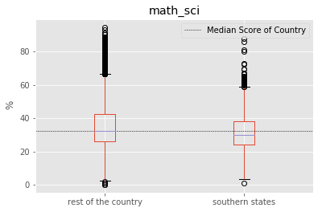


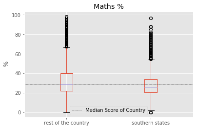


```python
plt.figure(1)
sns.countplot(x="is_south", data=south)
plt.figure(2)
sns.countplot(x="south_vs_rest", data=south)
plt.show()
```


```python
# sns.stripplot(x="is_south", y="math_sci",data=south, jitter=True, alpha=0.2)
plt.figure(figsize = (10,6))
f = sns.violinplot(x="is_south", y="math_sci",data=south, fliersize=0, width = .3, notch =True, linewidth =1)
plt.axhline(south["math_sci"].median(), color='r', linewidth = 1, linestyle ="--",\
                label="Median Score of Country")
f.set_xticklabels(["rest of the country","southern states"])

# plotting the count data
plt.scatter(x = south.groupby("is_south").count()["State"].index,\
            y = [-10.0,-10.0],\
            s = south.groupby("is_south").count()["State"].values/25,\
            c="k", linewidth=1,alpha =0.4, label = "Sample size")

plt.suptitle("Math and Science Score")
plt.xlabel("")
plt.ylabel("%")
plt.legend(loc =8)
plt.show()
```


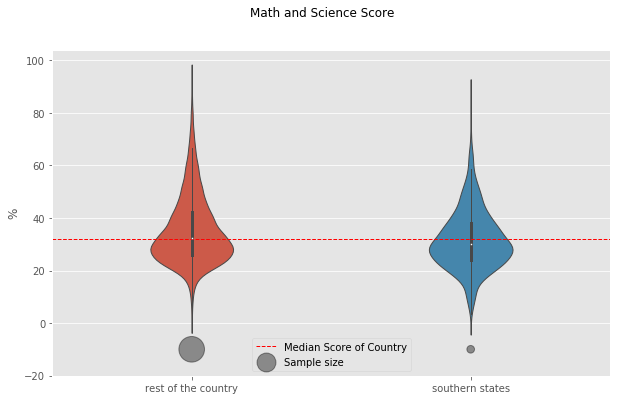


```python
# spltting each southern state to compare with the rest of the country
for factor in ["math_sci","Maths %","Science %"]:
    fig = south.boxplot(column = factor, by ="south_vs_rest")
    plt.axhline(south[factor].median(), color='k', linewidth = 0.5, linestyle ="--",\
                label="Median Score of Country")
    plt.ylabel(" %")
    plt.suptitle("")
    plt.xlabel("")
    plt.legend()
    plt.show()
```


```python
count = south.groupby("south_vs_rest").count()["State"].reindex(index=["Rest","AP","KA","KL","TN"])
```


```python
# Math and science score for each of the southern state
plt.figure(figsize = (10,6))

f = sns.violinplot(x="south_vs_rest", y="math_sci",data=south,\
                   fliersize=0, width = .3, notch =True, linewidth =1,\
                  order=["Rest","AP","KA","KL","TN"])
plt.axhline(south["math_sci"].median(), color='r', linewidth = 1, linestyle ="--",\
                label="Median Score of Country")
f.set_xticklabels(["Rest of the\ncountry","Andhra\nPradesh","Karnataka","Kerala", "Tamil\nNadu"])

plt.scatter(x =[0,1,2,3,4], y=[-10,-10,-10,-10,-10],s = count/15,\
            label ="Sample size", alpha =0.3,color ="k",linewidth=1,\
            linestyle ="solid")

plt.suptitle("Math and Science Score")
plt.xlabel("")
plt.ylabel("%")
plt.legend()
# plt.twinx()
# sns.countplot(x="south_vs_rest", data=south, width = 0.2)
plt.show()
```


